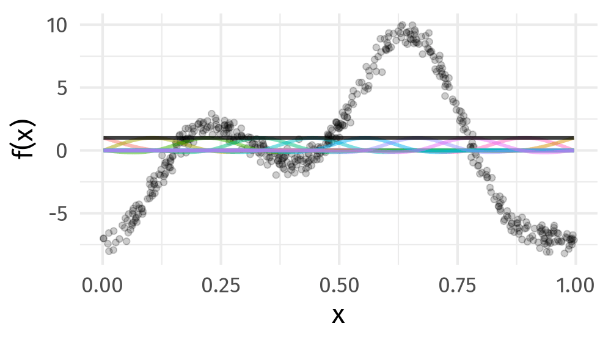
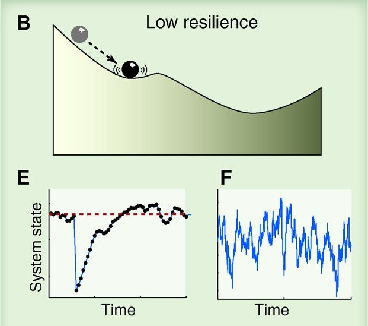
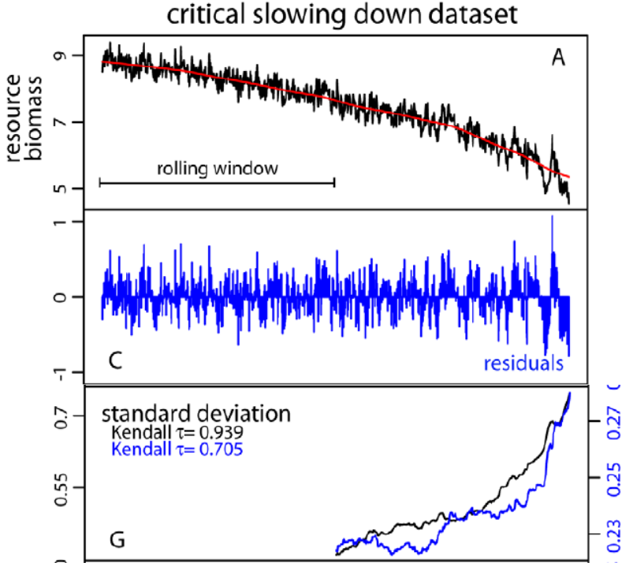
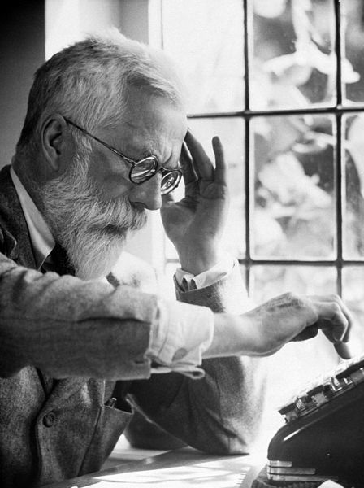
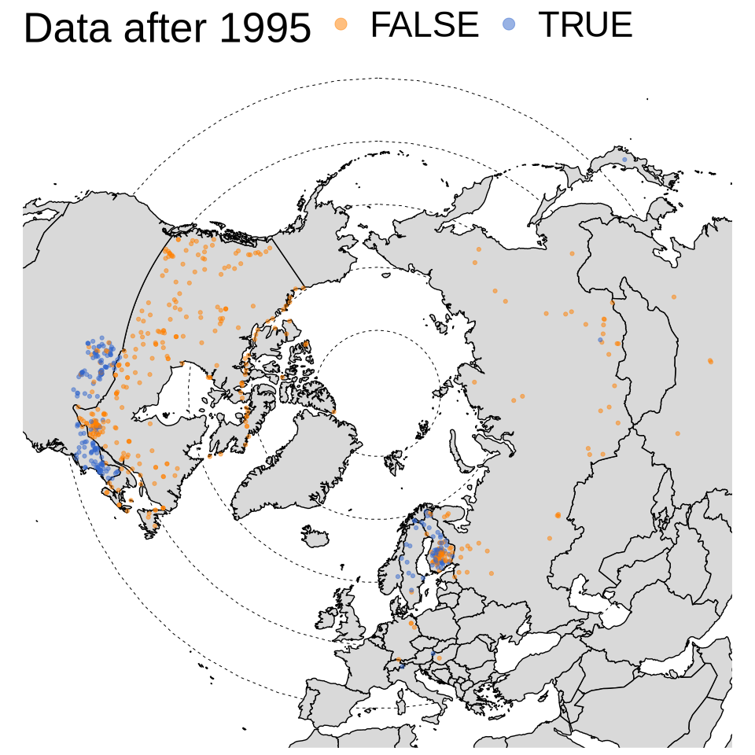
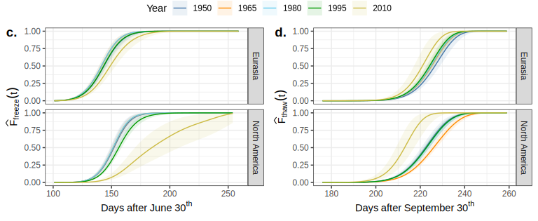

class: inverse middle center subsection

```{r setup, include=FALSE, cache=FALSE}
options(htmltools.dir.version = FALSE)
knitr::opts_chunk$set(cache = TRUE, dev = 'svg', echo = FALSE, message = FALSE, warning = FALSE,
                      fig.height=6, fig.width = 1.777777*6)

library("curl")
library("ggplot2")
library("dplyr")
library("tibble")
library('tidyr')
library('mgcv')
library('forcats')
library('mvnfast')
library('purrr')
library('gganimate')
library('gratia')
library('readr')
library('cowplot')
theme_set(theme_minimal(base_size = 14, base_family = 'Fira Sans'))
library('readxl')
library('here')

## constats
anim_width <- 1000
anim_height <- anim_width / 1.77777777
anim_dev <- 'png'
anim_res <- 200
```

# Use statistics to learn from data in presence of noise

???

One way to describe statistics is the principled process by which we learn from data in the presence of noise and uncertainty

---
class: inverse
background-image: url('./resources/franki-chamaki-z4H9MYmWIMA-unsplash.jpg')
background-size: cover

# 

.footnote[
<a style="background-color:black;color:white;text-decoration:none;padding:4px 6px;font-family:-apple-system, BlinkMacSystemFont, &quot;San Francisco&quot;, &quot;Helvetica Neue&quot;, Helvetica, Ubuntu, Roboto, Noto, &quot;Segoe UI&quot;, Arial, sans-serif;font-size:12px;font-weight:bold;line-height:1.2;display:inline-block;border-radius:3px" href="https://unsplash.com/@franki?utm_medium=referral&amp;utm_campaign=photographer-credit&amp;utm_content=creditBadge" target="_blank" rel="noopener noreferrer" title="Download free do whatever you want high-resolution photos from Franki Chamaki"><span style="display:inline-block;padding:2px 3px"><svg xmlns="http://www.w3.org/2000/svg" style="height:12px;width:auto;position:relative;vertical-align:middle;top:-2px;fill:white" viewBox="0 0 32 32"><title>unsplash-logo</title><path d="M10 9V0h12v9H10zm12 5h10v18H0V14h10v9h12v-9z"></path></svg></span><span style="display:inline-block;padding:2px 3px">Franki Chamaki</span></a>
]

???

We learn from data because it can highlight our preconceptions and biases

---

# Learning from data

```{r lm-plot, fig.height=6, fig.width = 1.777777*6}
## simulate some data for a linear model
set.seed(1)
N <- 250
lm_dat <- tibble(x = runif(N), y = 0.5 + (2.1 * x) + rnorm(N, sd = 0.5))
## plot
ggplot(lm_dat, aes(x = x, y = y)) +
    geom_point() +
    geom_smooth(method = 'lm') +
    theme_minimal(base_size = 20, base_family = 'Fira Sans')
```

???

Learning from data could be a simple as fitting a linear regression model...

---
class: inverse
background-image: url('./resources/deep-learning-turned-up-to-11.jpg')
background-size: contain

# 

???

Or as complex as fitting a sophisticated multi-layered neural network trained on huge datasets or corpora

---

# Learning involves trade-offs

.row[
.col-6[
.center[]
]

.col-6[
.center[]
]
]

???

Learning from data involves trade offs

We can have models that fit our data well &mdash; low bias &mdash; but which are highly variable, or

We can fit models that have lower variance, but these tend to have higher bias, i.e. fit the data less well

A linear regression model is very interpretable but unless the underlying relationship is linear it will have poor fit

Deep learning may fit data incredibly well but the model is very difficult to interpret and understand

---

# Generalized Additive Models

<br />


.references[Source: [GAMs in R by Noam Ross](https://noamross.github.io/gams-in-r-course/)]

???

GAMs are an intermediate-complexity model

* can learn from data without needing to be informed by the user
* remain interpretable because we can visualize the fitted features

```{r smooth-fun-animation, results = FALSE}
f <- function(x) {
    x^11 * (10 * (1 - x))^6 + ((10 * (10 * x)^3) * (1 - x)^10)
}

draw_beta <- function(n, k, mu = 1, sigma = 1) {
    rmvn(n = n, mu = rep(mu, k), sigma = diag(rep(sigma, k)))
}

weight_basis <- function(bf, x, n = 1, k, ...) {
    beta <- draw_beta(n = n, k = k, ...)
    out <- sweep(bf, 2L, beta, '*')
    colnames(out) <- paste0('f', seq_along(beta))
    out <- as_tibble(out)
    out <- add_column(out, x = x)
    out <- pivot_longer(out, -x, names_to = 'bf', values_to = 'y')
    out
}

random_bases <- function(bf, x, draws = 10, k, ...) {
    out <- rerun(draws, weight_basis(bf, x = x, k = k, ...))
    out <- bind_rows(out)
    out <- add_column(out, draw = rep(seq_len(draws), each = length(x) * k),
                      .before = 1L)
    class(out) <- c("random_bases", class(out))
    out
}

plot.random_bases <- function(x, facet = FALSE) {
    plt <- ggplot(x, aes(x = x, y = y, colour = bf)) +
        geom_line(lwd = 1, alpha = 0.75) +
        guides(colour = FALSE)
    if (facet) {
        plt + facet_wrap(~ draw)
    }
    plt
}

normalize <- function(x) {
    rx <- range(x)
    z <- (x - rx[1]) / (rx[2] - rx[1])
    z
}

set.seed(1)
N <- 500
data <- tibble(x     = runif(N),
               ytrue = f(x),
               ycent = ytrue - mean(ytrue),
               yobs  = ycent + rnorm(N, sd = 0.5))

k <- 10
knots <- with(data, list(x = seq(min(x), max(x), length = k)))
sm <- smoothCon(s(x, k = k, bs = "cr"), data = data, knots = knots)[[1]]$X
colnames(sm) <- levs <- paste0("f", seq_len(k))
basis <- pivot_longer(cbind(sm, data), -(x:yobs), names_to = 'bf')
basis

set.seed(2)
bfuns <- random_bases(sm, data$x, draws = 20, k = k)

smooth <- bfuns %>%
    group_by(draw, x) %>%
    summarise(spline = sum(y)) %>%
    ungroup()

p1 <- ggplot(smooth) +
    geom_line(data = smooth, aes(x = x, y = spline), lwd = 1.5) +
    labs(y = 'f(x)', x = 'x') +
    theme_minimal(base_size = 16, base_family = 'Fira Sans')

smooth_funs <- animate(
    p1 + transition_states(draw, transition_length = 4, state_length = 2) + 
    ease_aes('cubic-in-out'),
    nframes = 200, height = anim_height, width = anim_width, res = anim_res, dev = anim_dev)

anim_save('resources/spline-anim.gif', smooth_funs)
```

---

# HadCRUT4 time series

```{r hadcrut-temp-example, fig.height = 6}
## Load Data
tmpf <- tempfile()
curl_download("https://www.metoffice.gov.uk/hadobs/hadcrut4/data/current/time_series/HadCRUT.4.6.0.0.annual_nh.txt", tmpf)
gtemp <- read.table(tmpf, colClasses = rep("numeric", 12))[, 1:2] # only want some of the variables
names(gtemp) <- c("Year", "Temperature")
gtemp <- as_tibble(gtemp)

## Plot
gtemp_plt <- ggplot(gtemp, aes(x = Year, y = Temperature)) +
    geom_line() + 
    geom_point() +
    labs(x = 'Year', y = expression(Temperature ~ Anomaly ~ degree*C)) +
    theme_minimal(base_size = 20, base_family = 'Fira Sans')
gtemp_plt
```

---

# Polynomials

```{r hadcrut-temp-polynomial}
p <- c(1,3,8,15)
N <- 300
newd <- with(gtemp, data.frame(Year = seq(min(Year), max(Year), length = N)))
polyFun <- function(i, data = data) {
    lm(Temperature ~ poly(Year, degree = i), data = data)
}
mods <- lapply(p, polyFun, data = gtemp)
pred <- vapply(mods, predict, numeric(N), newdata = newd)
colnames(pred) <- p
newd <- cbind(newd, pred)
polyDat <- gather(newd, Degree, Fitted, - Year)
polyDat <- mutate(polyDat, Degree = ordered(Degree, levels = p))
gtemp_plt + geom_line(data = polyDat, mapping = aes(x = Year, y = Fitted, colour = Degree),
                      size = 1.5, alpha = 0.9) +
    scale_color_brewer(name = "Degree", palette = "PuOr") +
    theme(legend.position = "right")
```

---
class: inverse middle center subsection

# GAMs use splines

---

# Splines formed from basis functions

```{r basis-functions, fig.height=6, fig.width = 1.777777*6}
ggplot(basis,
       aes(x = x, y = value, colour = bf)) +
    geom_line(lwd = 2, alpha = 0.5) +
    guides(colour = FALSE) +
    labs(x = 'x', y = 'b(x)') +
    theme_minimal(base_size = 20, base_family = 'Fira Sans')
```

???

Splines are built up from basis functions

Here I'm showing a cubic regression spline basis with 10 knots/functions

We weight each basis function to get a spline. Here all the basisi functions have the same weight so they would fit a horizontal line

---

# Weight basis functions &#8680; spline

```{r basis-function-animation, results = 'hide'}
bfun_plt <- plot(bfuns) +
    geom_line(data = smooth, aes(x = x, y = spline),
              inherit.aes = FALSE, lwd = 1.5) +
    labs(x = 'x', y = 'f(x)') +
    theme_minimal(base_size = 14, base_family = 'Fira Sans')

bfun_anim <- animate(
    bfun_plt + transition_states(draw, transition_length = 4, state_length = 2) + 
    ease_aes('cubic-in-out'),
    nframes = 200, height = anim_height, width = anim_width, res = anim_res, dev = anim_dev)

anim_save('resources/basis-fun-anim.gif', bfun_anim)
```

.center[]

???

But if we choose different weights we get more wiggly spline

Each of the splines I showed you earlier are all generated from the same basis functions but using different weights

---

# How do GAMs learn from data?

```{r example-data-figure, fig.height=6, fig.width = 1.777777*6}
data_plt <- ggplot(data, aes(x = x, y = ycent)) +
    geom_line(col = 'goldenrod', lwd = 2) +
    geom_point(aes(y = yobs), alpha = 0.2, size = 3) +
    labs(x = 'x', y = 'f(x)') +
    theme_minimal(base_size = 20, base_family = 'Fira Sans')
data_plt
```

???

How does this help us learn from data?

Here I'm showing a simulated data set, where the data are drawn from the orange functions, with noise. We want to learn the orange function from the data

---

# Maximise penalised log-likelihood &#8680; &beta;

```{r basis-functions-anim, results = "hide"}
sm2 <- smoothCon(s(x, k = k, bs = "cr"), data = data, knots = knots)[[1]]$X
beta <- coef(lm(ycent ~ sm2 - 1, data = data))
wtbasis <- sweep(sm2, 2L, beta, FUN = "*")
colnames(wtbasis) <- colnames(sm2) <- paste0("F", seq_len(k))
## create stacked unweighted and weighted basis
basis <- as_tibble(rbind(sm2, wtbasis)) %>%
    add_column(x = rep(data$x, times = 2),
               type = rep(c('unweighted', 'weighted'), each = nrow(sm2)),
               .before = 1L)
##data <- cbind(data, fitted = rowSums(scbasis))
wtbasis <- as_tibble(rbind(sm2, wtbasis)) %>%
    add_column(x      = rep(data$x, times = 2),
               fitted = rowSums(.),
               type   = rep(c('unweighted', 'weighted'), each = nrow(sm2))) %>%
    pivot_longer(-(x:type), names_to = 'bf')
basis <- pivot_longer(basis, -(x:type), names_to = 'bf')

p3 <- ggplot(data, aes(x = x, y = ycent)) +
    geom_point(aes(y = yobs), alpha = 0.2) +
    geom_line(data = basis,
              mapping = aes(x = x, y = value, colour = bf),
              lwd = 1, alpha = 0.5) +
    geom_line(data = wtbasis,
              mapping = aes(x = x, y = fitted), lwd = 1, colour = 'black', alpha = 0.75) +
    guides(colour = FALSE) +
    labs(y = 'f(x)', x = 'x') +
    theme_minimal(base_size = 16, base_family = 'Fira Sans')

crs_fit <- animate(p3 + transition_states(type, transition_length = 4, state_length = 2) + 
                   ease_aes('cubic-in-out'),
                   nframes = 100, height = anim_height, width = anim_width, res = anim_res,
                   dev = anim_dev)

anim_save('./resources/gam-crs-animation.gif', crs_fit)
```

.center[]

???

Fitting a GAM involves finding the weights for the basis functions that produce a spline that fits the data best, subject to some constraints

---
class: inverse middle center subsection

# Avoid overfitting our sample

---
class: inverse middle center subsection

# Use a wiggliness penalty &mdash; avoid fitting too wiggly models

---

# HadCRUT4 time series

```{r hadcrut-temp-penalty}
K <- 40
lambda <- c(10000, 1, 0.01, 0.00001)
N <- 300
newd <- with(gtemp, data.frame(Year = seq(min(Year), max(Year), length = N)))
fits <- lapply(lambda, function(lambda) gam(Temperature ~ s(Year, k = K, sp = lambda), data = gtemp))
pred <- vapply(fits, predict, numeric(N), newdata = newd)
op <- options(scipen = 100)
colnames(pred) <- lambda
newd <- cbind(newd, pred)
lambdaDat <- gather(newd, Lambda, Fitted, - Year)
lambdaDat <- transform(lambdaDat, Lambda = factor(paste("lambda ==", as.character(Lambda)),
                                                  levels = paste("lambda ==", as.character(lambda))))

gtemp_plt + geom_line(data = lambdaDat, mapping = aes(x = Year, y = Fitted, group = Lambda),
                      size = 1, colour = "#e66101") +
    facet_wrap( ~ Lambda, ncol = 2, labeller = label_parsed)
options(op)
```
---

# Fitted GAM

```{r hadcrutemp-fitted-gam}
m <- gamm(Temperature ~ s(Year), data = gtemp, correlation = corARMA(form = ~ Year, p = 1))

N <- 300
newd <- as_tibble(with(gtemp, data.frame(Year = seq(min(Year), max(Year), length = N))))
pred <- as_tibble(as.data.frame(predict(m$gam, newdata = newd, se.fit = TRUE,
                                        unconditional = TRUE)))
pred <- bind_cols(newd, pred) %>%
    mutate(upr = fit + 2 * se.fit, lwr = fit - 2*se.fit)

ggplot(gtemp, aes(x = Year, y = Temperature)) +
    geom_point() +
    geom_ribbon(data = pred,
                mapping = aes(ymin = lwr, ymax = upr, x = Year), alpha = 0.4, inherit.aes = FALSE) +
    geom_line(data = pred,
              mapping = aes(y = fit, x = Year), inherit.aes = FALSE, size = 1, colour = "#025196") +
    labs(x = 'Year', y = expression(Temeprature ~ degree*C)) +
    theme_minimal(base_size = 20, base_family = 'Fira Sans')
```

---
class: inverse middle center big-subsection

# Vignettes


---
class: inverse middle center big-subsection

# Vignette 1

---
class: inverse middle center subsection

# Statistical estimation of ecosystem variance

---
class: inverse middle center big-subsection

# Mean

???

The mean

When we analyze data we mostly focus on this property of our data

With summary statistics we often talk about the average of a set of values

Or in a statistical model we might estimate expected change in the response for some change in one or more covariates

Or we may be interested in estimating the trend in a data series where the trend described how the expected value of y changes over time


---
class: inverse middle center big-subsection

# Variance

???

There are other important properties of data however and in the short case study I want to talk about the variance & how we can use statistical models to investigate changes in the variance of ecosystems over time

---

# Variance

Intuitive & key descriptor of ecosystem state

.row[
.col-6[
.center[
```{r high-resilience}
knitr::include_graphics('./resources/scheffer-2012-high-resilience.jpg')
```
]
]

.col-6[
.center[
```{r low-resilience}

```
]
]
.col-12[
.small[Source: Scheffer *et al* Science (2012)]
]
]

???

The variance is an important measure of ecosystem state

Ecologists have linked variance with coexistence of populations and variance can be interpreted in terms of resilience theory

Here I'm showing two cartoons;

A: in the high resilience state the ecosystem returns rapidly to the equilibrium following perturbation and hence has low variance

B: in the low resilience state, where the basin of attraction has become shallower, the ecosystem takes longer to return to equilibrium following perturbation and hence exhibits high variance

Variance, however, is much harder to estimate from data

---

# Moving windows &mdash; don't do this!

.row[
.col-6[

Moving window approach:

1. detrend
2. choose window size
3. estimate variance
4. move window 1 time step
5. repeat 3. & 4. until done
6. look for trend

]

.col-6[
.center[
```{r moving-window}

```
]
.small[Modified from Dakos *et al* (2012) PLOS One]
]
]

???

One way to estimate the variance of a series is by using a moving window

Here the analyst first detrends the time series

Choose an appropriate window size

Starting from the beginning of the series calculate the variance of the observations in the window

Move the window along one time step and repeat 3 and 4 until you get to the end of the series

A trend in the resulting variance time series is estimated using Kendall's rank correlation tau

In this example the interest was in the end of the series so they right-aligned the window meaning they had to observe half the series before they could calculate the variance

---

# Problems

*Ad hoc*

* How to detrend (method, complexity of trend, ...)
* What window width?

Ideally regularly spaced data

* What to do about gaps, missing data, irregularly spaced data?

Statistical testing hard

* Kendall's $\tau$ assumes independence
* Surrogate time series assumes regular sampling, sensitive to choice of ARMA

???

The whole approach is *ad hoc* with many knobs to twiddle &mdash; how do you detrend the series? what width of window should be used?

Suited to regularly spaced data so you have the same number of observations in each window, but what about series with data gaps, missing observations, or data that are irregularly spaced?

Statistical inference is very hard; Kendall's tau assumes the data are independence but they can't be because of the moving window. Sometime surrogate time series are used to assess significance of the trend in variance; Surrogate time series are series generated with known properties that don't have a change in variance, but these approaches rely on classical techniques like ARMA models which only work for regularly spaced data and the test is sensitive to choice of orders in the ARMA

---
class: inverse middle center big-subsection

# Lake 227

???

Today I want to illustrate how we can use modern statistical models to continuously estimate the variance of multivariate time series using data from Lake 227 in the Experimental Lakes Area, Canada

---

# Lake 227

.row[
.col-6[
* Experimentally manipulated
* Annual sediment samples 1943&ndash;1990
]
.col-6[
* Analyzed for fossil pigments
]
]

Cottingham *et al* (2000) **Ecology Letters** showed via a Levene's test that **variances** pre- & post-intervention were different

???

The lake was experimentally manipulated to investigate responses to increased nutrients

The lake is annually laminated and Peter Leavitt, URegina, measured the sub-fossil pigment concentrations for each year between 1943 and 1990

Kathy Cottingham, Jim Rusak, and Peter Leavitt previously analyzed these data by separating them into control and treated sections and compared the variances of the two periods with a Levene's test, equivalent of a t-test but for differences of variances not means

They showed that the algal community was more variable in the treated period than in the pre-manipulation period

---

# Lake 227

```{r lake-227-pigment-data}
## Load data from ~/work/data/ela/lake227
lake227 <- read_excel('~/work/data/ela/lake227/CONC227.xlsx')
## Peter highlighted Fuco, Allox, Lutzeax, Pheo_b, Bcarot
vars <- c('YEAR', 'FUCO', 'ALLOX', 'LUTZEAX', 'PHEO_B', 'BCAROT')#, 'ECHINENO', 'MYXO')
lake227 <- lake227[, vars]
names(lake227) <- c('Year', 'Fucoxanthin', 'Alloxanthin', 'LuteinZeaxanthin',
                    'Pheophytinb', 'BetaCarotene')#, 'Echinenone', 'Myxoxnthophyll')
## take data from 1943 onwards
lake227 <- subset(lake227, Year >= 1943)
lake227 <- as_tibble(lake227)
## to long format for modelling
lake227 <- gather(lake227, key = Pigment, value = Concentration, - Year)
lake227 <- lake227 %>%
    mutate(Pigment = as.character(Pigment),
           Pigment = case_when(
               Pigment == 'BetaCarotene' ~ 'beta ~ carotene',
               Pigment == 'Pheophytinb' ~ 'Pheophytin ~ italic(b)',
               Pigment == 'LuteinZeaxanthin' ~ 'atop(Lutein, Zeaxanthin)',
               TRUE ~ Pigment),
           )

ggplot(lake227, aes(x = Year, y = Concentration, group = Pigment, colour = Pigment)) +
    geom_line(size = 1) +
    geom_point(size = 2) +
    facet_grid(Pigment ~ ., scales = 'free_y', labeller = 'label_parsed') +
    theme(legend.position = 'none',
          strip.text.y = element_text(size = 14, angle = 0),
          strip.background = element_rect(colour = '#fdb338', fill = '#fdb338')) +
    labs(x = NULL, y = expression(Concentration ~ (italic(n) * g ~ g^{-1})))
```

???

Today I will focus only on the main algal groups:

* diatoms & chrysophytes through Fucoxanthin,
* cryptophytes through Alloxanthin,
* cyanobacteria and chlorophytes through Lutein-Zeaxanthin & pheophytin b, and
* total algae through beta carotene

---
class: inverse middle center big-subsection

# Challenge

???

The challenge is to estimate how the mean **and** the variance changed continuously throughout the experimental manipulation

---

# Parameters beyond the mean

```{r gaussian-distributions-plt}
x <- seq(8, -8, length = 500)
df <- data.frame(density = c(dnorm(x, 0, 1), dnorm(x, 0, 2), dnorm(x, 2, 1), dnorm(x, -2, 1)),
                 x = rep(x, 4),
                 distribution = factor(rep(c("mean = 0; var = 1", "mean = 0; var = 4",
                                             "mean = 2; var = 1", "mean = -2; var = 1"), each = 500),
                                       levels = c("mean = 0; var = 1", "mean = 0; var = 4",
                                                  "mean = 2; var = 1", "mean = -2; var = 1")))
plt1 <- ggplot(subset(df, distribution %in% c("mean = 0; var = 1", "mean = 0; var = 4")),
               aes(x = x, y = density, colour = distribution)) +
    geom_line(size = 1) + theme(legend.position = "top") +
    guides(col = guide_legend(title = "Distribution", nrow = 2, title.position = "left")) +
    labs(x = 'x', y = "Probability density")

plt2 <- ggplot(subset(df, distribution %in% c("mean = 2; var = 1", "mean = -2; var = 1")),
               aes(x = x, y = density, colour = distribution)) +
    geom_line(size = 1) + theme(legend.position = "top") +
    guides(col = guide_legend(title = "Distribution", nrow = 2, title.position = "left")) +
    labs(x = 'x', y = "Probability density")

plt <- plot_grid(plt2, plt1, ncol = 2, align = "vh")
plt
```

???

To do this we'll need models for the variance of a data set

If we think of the Gaussian distribution that distribution has two parameters, the mean and the variance

In linear regression we model the mean of the response at different values of the covariates, and assume the variance is constant at a value estimated from the residuals

In the left panel I'm showing how the Gaussian distribution changes as we alter the mean while keeping the variance fixed, while in the right panel I keep the mean fixed but vary the variance &mdash; the parameters are independent

---

# Distributional models

.medium[
$$y_{i} | \boldsymbol{x}_i \sim \mathcal{D}(\vartheta_{1}(\boldsymbol{x}_i), \ldots, \vartheta_{K}(\boldsymbol{x}_i))$$
]

For the Gaussian distribution

* $\vartheta_{1}(\boldsymbol{x}_i) = \mu(\boldsymbol{x}_i)$

* $\vartheta_{2}(\boldsymbol{x}_i) = \sigma(\boldsymbol{x}_i)$

???

Instead of treating the variance as a nuisance parameter, we could model both the variance **and** the mean as functions of the covariates

This is done using what is called a *distributional model*

In this model we say that the response values y_i, given the values of one or more covariates x_i follow some distribution with parameters theta, which are themselves functions of one or more covariates

For the Gaussian distribution theta 1 would be the mean and theta 2 the variance (or standard deviation)

We do not need to restrict ourselves to the Gaussian distribution however

---

# The Gamma distribution

```{r gamma-dist}
shape <- c(2,2,3,3,5,5)
scale <- c(2,4,2,1,1,0.5)
x <- seq(0, 20, length.out = 500)
df <- as_tibble(as.data.frame(mapply(dgamma, shape, scale, MoreArgs = list(x = x))))
names(df) <- paste('shape =', shape, ', scale =', scale)
df <- add_column(df, x = x, row = seq_len(nrow(df)))
df <- gather(df, 'distribution', 'density', -row, -x)
plt <- ggplot(df, aes(x = x, y = density, colour = distribution)) +
    geom_line(lwd = 1) + guides(colour = "none") +
    scale_color_discrete(name = "") + ylim(0, 1.5) +
    labs(y = "Probability Density")
plt
```

???

The gamma distribution would be more appropriate for describing the pigment data as it allows for positive continuous values, where those values are skewed, with some large values

Here I'm showing different types of gamma distribution that vary in the mean and their variance and we should note that unlike the Gaussian distribution, we cannot change the mean without also changing the variance of the gamma distribution

---

# Lake 227 sedimentary pigments

Fitted gamma distributional model using **brms** and **Stan**
\begin{align*}
y_t    & \sim \mathcal{G}(\mu = \eta_{1,t}, \alpha = \eta_{2,t}) \\
\eta_{1,t} & = \exp(f_{1,\text{pigment}}(\text{Year}_t)) \\
\eta_{2,t} & = \exp(f_{2,\text{pigment}}(\text{Year}_t))
\end{align*}

???

To estimate how the mean and the variance of the pigment data changed during the experimental manipulation, I fitted a gamma distributional model using the brms package and the Stan Bayesian software

We assume the responses are conditionally distributed gamma, and we model the mean and the shape parameter of the distribution with linear predictors

Each linear predictor includes a smooth function of Year for each pigment

After fitting we calculate the variance at each time point using the estimated values of the mean and the shape parameters using the posterior distribution of the response to generate credible intervals

---

# Results &mdash; pigment means

```{r load-lake-227-results}
m2_summ <- read_rds(here('data', 'lake-227-m2-model-output.rds')) %>%
    mutate(Pigment = as.character(Pigment),
           Pigment = case_when(
               Pigment == 'BetaCarotene' ~ 'beta ~ carotene',
               Pigment == 'Pheophytinb' ~ 'Pheophytin ~ italic(b)',
               Pigment == 'LuteinZeaxanthin' ~ 'atop(Lutein, Zeaxanthin)',
               TRUE ~ Pigment),
           )
```

```{r lake-227-fitted-mean, dependson = -1}
ggplot(filter(m2_summ, Parameter == "Mean"),
       aes(x = Year, group = Pigment, fill = Pigment)) +
    geom_ribbon(aes(ymax = upper, ymin = lower, fill = Pigment), alpha = 0.2) +
    geom_line(aes(y = est, colour = Pigment), size = 1) +
    facet_grid(Pigment ~ ., scales = 'free_y', labeller = 'label_parsed') +
    theme(legend.position = 'none',
          strip.text.y = element_text(size = 14, angle = 0),
          strip.background = element_rect(colour = '#fdb338', fill = '#fdb338')) +
    labs(x = NULL, y = expression(Estimated ~ concentration ~ (italic(n) * g ~ g^{-1})))
```

???

This plot shows the estimated mean concentration for the five pigments estimated from the model, and which shows the increase in algal abundance during the experimental manipulation

---

# Results &mdash; pigment variances

```{r lake-227-fitted-sigma, dependson = -2}
ggplot(filter(m2_summ, Parameter == "Sigma"),
       aes(x = Year, group = Pigment, fill = Pigment)) +
    geom_ribbon(aes(ymax = upper, ymin = lower, fill = Pigment), alpha = 0.2) +
    geom_line(aes(y = est, colour = Pigment), size = 1) +
    facet_grid(Pigment ~ ., scales = 'free_y', labeller = 'label_parsed') +
    theme(legend.position = 'none', strip.text.y = element_text(size = 14, angle = 0),
          strip.background = element_rect(colour = '#fdb338', fill = '#fdb338')) +
    labs(x = NULL, y = expression(Estimated ~ sigma ~ (italic(n) * g ~ g^{-1})))
```

???

In this plot are showing the estimated variance throughout the time series

We clearly see the increased variance in the algal communities that Cottingham et al observed, but now we can provide a continuous estimate of the variance over time rather than having to split the data into two and compare the variance of the two time periods

---

# Summary

* Using distributional GAMs we now have a means to robustly estimate the variance of an system and how that variance changes over time

* Use models such as these to begin to quantify an important ecological metric from a principled statsitical view point

---
class: inverse middle center big-subsection

# Vignette 2

---
class: inverse middle center subsection

# Climate change affecting lake temperatures?

---

```{r load-process-lake-temp-data}
## load GEV support functions
source("./functions/gev-distribution.R")

## load data
lake <- read_csv("./data/lake-temperature-time-series.csv",
                 skip = 1L,         # setting col name so skip those provided
                 col_names = c('date','temperature','lake'),
                 col_types = 'Ddc') # D = Date, d = double, c = character

## prepare data
## add some useful variables
lake <- mutate(lake,
               year  = as.numeric(format(date, format = '%Y')),
               lake  = factor(lake),
               lake  = fct_recode(lake,
                                  `Blelham Tarn` = 'BLEL',
                                  `Esthwaite Water` = 'ESTH',
                                  Feeagh = 'FEEAGH',
                                  `Loch Leven` = 'LEVEN',
                                  `Vättern` = 'VATTERN',
                                  `Windermere North` = 'NBAS',
                                  `Windermere South` = 'SBAS',
                                  `Wörthersee` = 'WORTHERSEE',
                                  `Zürichsee` = 'ZURICH'))

## compute annual minimum lake water temperature
minima <- lake %>% group_by(lake, year) %>%
    summarize(minimum = min(temperature, na.rm = TRUE)) %>%
    mutate(cyear = year - median(seq(min(year), max(year), by = 1L)),
           neg_min = -minimum) %>% 
    ungroup()

## store the median year that we used to centre year by
med_year <- minima %>% select(year) %>%
    summarise(median_year = median(year)) %>%
    pull(median_year)

## constants for plots
min_temp_label <- 'Surface temperature (°C)'

## model set up
ctrl <- gam.control(nthreads = 4) # use multiple threads to fit

## model
m1 <- gam(list(neg_min ~ s(cyear, lake, bs = 'fs'),
               ~ s(cyear, lake, bs = 'fs'),
               ~ s(cyear, lake, bs = 'fs')),
          data = minima, method = 'REML',
          family = gevlss(link = list('identity', 'identity', 'logit')),
          control = ctrl, optimizer = 'efs')

fit <- fitted(m1)
mu  <- fit[,1]
rho <- fit[,2]
xi  <- fit[,3]
fv  <- mu + exp(rho) * (gamma(1 - xi) - 1) / xi

## Get the predicted expected response...
m1_diag <- tibble(fitted = -(mu + exp(rho) * (gamma(1 - xi) - 1) / xi),
                  resid  = residuals(m1))
m1_diag <- bind_cols(minima, m1_diag)

## the next block of code simulates ~95% confidence interval
## on the fitted values only, and plots this with the observed
## data
sims <- fitted_draws_gev_gam(m1, nsim = 10000, seed = 3476,
                             minima = TRUE, ncores = 4)
upper <- apply(sims, 1L, quantile, probs = 0.975)
lower <- apply(sims, 1L, quantile, probs = 0.025)

m1_diag <- add_column(m1_diag, lower = lower, upper = upper)

## repeat this but for N values spread evenly over time series
## of each lake
N <- 200

## this requires a function to be applied to the data for each lake
## this simply returns a tibble with `lake`, `year`, `cyear`
## with `year` being N values spread evenly from the first year to
## the last
year_seq <- function(tbl, n, median_year) {
    df <- tibble(lake = rep(unique(tbl$lake), n),
                 year = seq_min_max(tbl$year, n = n))
    mutate(df, cyear = year - median_year)
}

## do the split-apply-combine to get year sequences per lake
newd <- minima %>% group_by(lake) %>%
    split(.$lake) %>%
    map_dfr(year_seq, n = N, median_year = med_year)

## add expected values from esimtated GEV on to the prediction data
m1_pred <- mutate(newd, fitted = -expected_gev(m1, newdata = newd))

## simulate 10000 draws from posterior of the model and return expected
## values from the GEV for each posterior draw
sims <- fitted_draws_gev_gam(m1, newdata = newd, nsim = 10000, seed = 3476,
                             minima = TRUE, ncores = 4)
## compute ~ 95% confidence intervals
upper <- apply(sims, 1L, quantile, probs = 0.975)
lower <- apply(sims, 1L, quantile, probs = 0.025)
## ...and add these to the prediction data
m1_pred <- add_column(m1_pred, lower = lower, upper = upper)

## Next blocks of code will compute the density of the estimated GEV
## distributions for common start years and end years for each lake
##
## We use the earliest and latest years for which we have data for all lakes
start_year <- minima %>% group_by(lake) %>%
    summarise(min_year = min(year)) %>%
    ungroup() %>%
    pull(min_year) %>%
    max()
## ...
last_year <- minima %>% group_by(lake) %>%
    summarise(max_year = max(year)) %>%
    ungroup() %>%
    pull(max_year) %>%
    min()

## Data to predict at; expansion of the start and end years and the 9 lakes
newd <- crossing(year = c(start_year, last_year),
                 lake = levels(minima$lake)) %>%
    mutate(cyear = year - med_year)

## predict GEV parameters for each lake in the two years
pred <- predict(m1, newdata = newd, type = 'response')
colnames(pred) <- c('mu','sigma','xi')
## need to put these on the correct scales
##  mu:    negated because this is block maxima model and so we modelled
##           the negative of the minima (exactly equivalent)
##  sigma: gevlss() sigma parameterised in terms of log(sigma) == rho
##           so we use the inverse link to back-transform
## probably should do this properly using the inverse link functions
##   in here('functions') in case we change the links in the model...
pred <- as_tibble(pred) %>%
    mutate(mu = -mu, sigma = exp(sigma))

## Need all combinations of GEV parameters and the sequence of
## minimum temperatures to evaluate density over (`x`)
gev_pars <- crossing(pred, x = seq(-1.5, 8, length.out = 1000))

## stick prediction data and predicted GEV parameters together
## Note: can't do this before we create `gev_pars()` via `crossing()`
##         as we don't want all combinations of *all* variables
pred <- bind_cols(newd, pred)

## compute the GEV density for all lakes & prepare data for plotting
gev_dens <- left_join(gev_pars, pred, by = c('mu', 'sigma', 'xi')) %>%
    select(-cyear) %>% 
    mutate(density = dgev(x, mu, sigma, xi),
           year = factor(year))
```

# 

.references[
Data: Woolway *et al* (2019) *Climate Change* **155**, 81&ndash;94 [doi: 10/c7z9](http://doi.org/c7z9)
]

```{r plot-blelham}
ggplot(filter(lake, lake == 'Blelham Tarn'), aes(x = date, y = temperature)) +
    geom_line() +
    guides(colour = FALSE) +
    theme_minimal(base_size = 20, base_family = 'Fira Sans') +
    labs(x = NULL, y = min_temp_label, title = 'Blelham Tarn, UK')
```

---
class: inverse middle center subsection

# Why worry about minimum temperatures?

---

# Why worry about minimum temperatures?

Annual minimum temperature is a strong control on many in-lake processes (eg Hampton *et al* 2017)

Extreme events can have long-lasting effects on lake ecology &mdash; mild winter in Europe 2006&ndash;7 (eg Straile *et al* 2010)

Reduction in habitat or refugia for cold-adapted species

* Arctic charr (*Salvelinus alpinus*)
* Opossum shrimp (*Mysis salemaai*)

.references[Hampton *et al* (2017). Ecology under lake ice. *Ecology Letters* **20**, 98–111. [doi: 10/f3tpzh](http://doi.org/f3tpzh)

Straile *et al* (2010). Effects of a half a millennium winter on a deep lake &mdash; a shape of things to come? *Global Change Biology* **16**, 2844–2856. [doi: 10/bx6t4d](http://doi.org/bx6t4d)]

---

# Multiple time series &#8680; HGAM

```{r plot-all-lakes}
ggplot(lake, aes(x = date, y = temperature, colour = lake)) +
    geom_line() +
    facet_wrap(~ lake) +
    guides(colour = FALSE) +
    theme_minimal(base_size = 20, base_family = 'Fira Sans') +
    labs(x = NULL, y = min_temp_label)
```

---
class: inverse center middle large-subsection

# Central Limit Theorem

???

Central limit theorem shows us that the Gaussian or normal distribution is the sampling distribution for many sample statistics, including sample means, as samples sizes become large

Central limit theorem underlies much of the theory that justifies much of the statistics you learn about in your statistics courses, and supports the use of the Gaussian or normal distribution

---

# Annual minimum temperature

```{r plot-minima}
ggplot(minima, aes(x = year, y = minimum, colour = lake)) +
    geom_line(lwd = 1) +
    facet_wrap(~ lake) +
    guides(colour = FALSE) +
    theme_minimal(base_size = 20, base_family = 'Fira Sans') +
    labs(x = NULL, y = min_temp_label)
```

---
class: inverse middle center large-subsection

# Block Minima

---

# Fisher&ndash;Tippett&ndash;Gnedenko theorem

> The **maximum** of a sample of *iid* random variables after proper renormalization can only converge in distribution to one of three possible distributions; the *Gumbel* distribution, the *Fréchet* distribution, or the *Weibull* distribution.

.row[

.col-4[
.center[
.smaller[Source: [Wikimedia Commons](https://commons.wikimedia.org/wiki/File:%E0%A4%B0%E0%A5%8B%E0%A4%A8%E0%A4%BE%E0%A4%A1%E0%A5%8D.jpg)]]
]
.col-4[ 
.center[]
.smaller[Source: [ral.ucar.edu](https://ral.ucar.edu/projects/extremes/Extremes/history.html)]
]
.col-4[ 
.center[]
.smaller[Source: [Wikimedia Commons](https://commons.wikimedia.org/wiki/File:Gnedenko.png)]
]

]

---
class: inverse middle center large-subsection

# Block Minima&hellip;?

---

# Negate the minima &#8680; maxima

```{r plot-minima-negated}
ggplot(minima, aes(x = year, y = -minimum, colour = lake)) +
    geom_line(lwd = 1) +
    facet_wrap(~ lake) +
    guides(colour = FALSE) +
    theme_minimal(base_size = 20, base_family = 'Fira Sans') +
    labs(x = NULL, y = min_temp_label)
```

---
class: inverse middle center large-subsection

# Three Distributions&hellip;?

---

# Generalised extreme value distribution

In 1978 Daniel McFadden demonstrated the common functional form for all three distributions — the GEVD

$$G(y) = \exp \left \{ - \left [ 1 + \xi \left ( \frac{y - \mu}{\sigma} \right ) \right ]_{+}^{-1/\xi} \right \}$$

.row[
.col-5[
Three parameters to estimate

* location $\mu$,
* scale $\sigma$, and
* shape $\xi$
]
.col-7[
Three distributions

* Gumbel distribution when $\xi$ = 0,
* Fréchet distribution when $\xi$ > 0, &
* Weibull distribution when $\xi$ < 0
]
]

---
class: inverse middle center subsection

# Fit Distributional GAM using GEV for response

---
class: inverse middle center subsection

# Model μ, σ, ξ with smooths of Year

---

# Estimated smooths

&nbsp;

```{r draw-gev-model-smooths, fig.height=4.5, fig.width = 13.5}
mu_smooths <- evaluate_smooth(m1, 's(cyear,lake)')
si_smooths <- evaluate_smooth(m1, 's.1(cyear,lake)')
xi_smooths <- evaluate_smooth(m1, 's.2(cyear,lake)')
mu_plt <- ggplot(mu_smooths, aes(x = cyear, y = est, colour = lake)) +
    geom_line(lwd = 1) +
    guides(colour = FALSE) +
    theme_minimal(base_size = 20, base_family = 'Fira Sans') +
    labs(x = 'Year (centred)', y = 'Effect', title = expression(mu ~ '~ s(cyear,lake)'))
si_plt <- ggplot(si_smooths, aes(x = cyear, y = est, colour = lake)) +
    geom_line(lwd = 1) +
    guides(colour = FALSE) +
    theme_minimal(base_size = 20, base_family = 'Fira Sans') +
    labs(x = 'Year (centred)', y = 'Effect', title = expression(sigma ~ '~ s(cyear,lake)'))
xi_plt <- ggplot(xi_smooths, aes(x = cyear, y = est, colour = lake)) +
    geom_line(lwd = 1) +
    guides(colour = FALSE) +
    theme_minimal(base_size = 20, base_family = 'Fira Sans') +
    labs(x = 'Year (centred)', y = 'Effect', title = expression(xi ~ '~ s(cyear,lake)'))

plot_grid(mu_plt, si_plt, xi_plt, ncol = 3, align = 'h', axis = 'tb')
```

---

# Observed vs fitted

```{r fitted-values-plot}
## plot of fitted vs observed minimum faceted by lake
ggplot(m1_diag, aes(x = fitted, y = minimum, colour = lake)) +
    geom_abline(slope = 1, intercept = 0, lwd = 1) +
    geom_point(size = 2.5, alpha = 0.6) +
    facet_wrap(~ lake) +
    guides(colour = FALSE) +
    theme_minimal(base_size = 20, base_family = 'Fira Sans') +
    labs(x = 'Model estimated temperature (°C)', y = min_temp_label)
```

---

# Estimated minimum temperature

```{r fitted-trends-plot}
ggplot(minima, aes(x = year, y = minimum, colour = lake)) +
    geom_line(lwd = 1) +
    geom_ribbon(aes(ymin = lower, ymax = upper, x = year), data = m1_pred,
                alpha = 0.3, inherit.aes = FALSE) +
    geom_line(aes(y = fitted, x = year), data = m1_pred, lwd = 1, inherit.aes = FALSE) +
    facet_wrap(~ lake) +
    labs(x = NULL, y = min_temp_label) +
    theme_minimal(base_size = 20, base_family = 'Fira Sans') +
    guides(colour = FALSE)
```

---

# Summary

* Lake **minimum** surface water temperatures have increased by on the order of 1&ndash;3 degrees over the last 60 years

* Evidence that the distribution of annual minima has changed in many lakes &mdash; implications for future extreme events which have long-term knock-on effects

* Distributional GAMs with the GEV distribution are an excellent way of modelling common trends in environmental extremes

---

# Current research

.row[

.col-6[
1. The California Cooperative Oceanic Fisheries Investigations (CalCOFI) &mdash; Natalya Gallo (UCSD)

2. Changing Ice-Phenology in north hemisphere lakes &mdash; Stefano Mezzini (UofR)
]

.col-6[

.center[
```{r hpam-lakes, out.width = '100%'}

```
]

]

]

---

# Ice Phenology

.center[
```{r hpam-spatial}
knitr::include_graphics('./resources/hpam-spatial-freeze.svg')
```
]

---

# Ice Phenology

.center[
```{r hpam-cdf, out.width = '100%'}

```
]

---

# Acknowledgements

### Funding

.row[

.col-6[
.center[]
]

.col-6[
.center[]
]

]

### Data

* Peter Leavitt (URegina) for the Lake 227 Data
* Iestyn Woolway and colleagues for archiving the lake surface water data
* Lake ice data from Global Lake and River Ice Phenology Database (GLRIPD, http://nsidc.org/data/G01377.html)

### Slides

* HTML Slide deck [bit.ly/hifmb-talk](http://bit.ly/hifmb-talk) &copy; Simpson (2020) [](http://creativecommons.org/licenses/by/4.0/)
