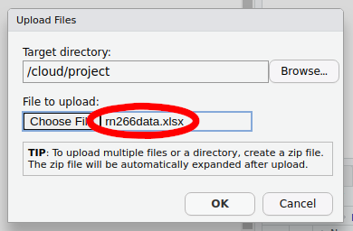
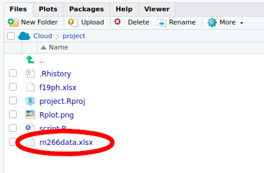

```{r load-cowplot, echo = FALSE, message = FALSE}
library('here')
library('cowplot')
```

#### This file is hosted at: [bit.ly/biol266nexp](http://bit.ly/biol266nexp)

# Getting started

To get started, open your web browser, head to [rstudio.cloud]() and log in using your RStudio Cloud account.

Once you have logged in, start a **New Project** by clicking the button to the right of "Your Projects"

```{r show-new-project-image, echo=FALSE, out.width="800px"}
knitr::include_graphics("../images/rstudio-cloud-new-project-annotated.png")
```

After you click the button, **rstudio.cloud** will deploy a new RStudio instance, which may take a minute or two, so be patient.

Once the RStudio instance is running, rename your project by clicking on the "Untitled Project" label at the top of the screen. Give the project a useful name, such as "biol 266".

```{r show-rename-project-image, echo=FALSE, out.width="450px"}
knitr::include_graphics("../images/rstudio-cloud-change-project-name-annotated.png")
```

## Opening a new script window

It is good practice to enter your R code into a R script. An R script is a plain text file that we save with the extension `.R`. All your code for the lab should go in here because

1. you can save the file and all your work as you go along so you have a record of what you did,
2. it is easier to edit your code and fix errors, mistakes, or typos in the script window, and
3. you can share the script file if you need help to track down an error.

To start a new script, go to the **File** menu, then select **New File** > **R Script**

```{r show-new-script-image, echo=FALSE, out.width="500px"}
knitr::include_graphics("../images/rstudio-cloud-new-script.png")
```

Or you can press <kbd>Ctrl</kbd> + <kbd>Shift</kbd> + <kbd>Alt</kbd> + <kbd>N</kbd> on Windows or <kbd>Cmd</kbd> + <kbd>Shift</kbd> + <kbd>Option</kbd> + <kbd>N</kbd> on a Mac.

Your RStudio screen should look like this

```{r show-studio-cloud-image, echo=FALSE, out.width="750px"}
knitr::include_graphics("../images/rstudio-cloud-screen-annotated.png")
```

## Installing R Packages

Once you have a new session running and named, click in the Console window by the **prompt** and run the code below by typing in the console exactly what is shown below and hitting <kbd>Return</kbd>

```{r install-pkgs, eval = FALSE}
install.packages(c('purrr', 'readxl', 'tidyr', 'dplyr', 'forcats',
                   'ggplot2', 'tibble', 'stringr', 'emmeans'))
```

This will take a few minutes to complete.

## Load Packages

We need to load the packages we just installed so they are ready to use. You need to do this each time you start R and want to use these packages. The installation step you just performed does *not* need to be each time you start R.

Click in the **script** window. Enter the lines of code below into the script window. The hash character `#` allows you to enter comments, which R will ignore.

```{r load-packages, results = "hide"}
library('purrr')
library('readxl')  # read from Excel sheets
library('tidyr')   # data processing
library('dplyr')   # mo data processing
library('forcats') # mo mo data processing
library('tibble')  # creating data frames
library('stringr') # process strings (text)
library('ggplot2') # plotting
library('emmeans') # for post hoc comparisons

theme_set(theme_bw()) # Set plot theme
```

Once you have entered all those lines of code into the script window, move the cursor to the first line or click on it, and then press the following keys:

* On Windows press <kbd>Ctrl</kbd> + <kbd>Enter</kbd>
* On Mac press <kbd>Cmd</kbd> + <kbd>Enter</kbd>

This will send the current line of code to the **console** window and move cursor to the start of the next line. Continue hitting <kbd>Ctrl</kbd> + <kbd>Enter</kbd> or <kbd>Cmd</kbd> + <kbd>Enter</kbd> until you have sent each line of code into the console. As you do so, R will load each package; some messages will be printed to the console, but this is OK as long as you do not see any **Errors**.

From now on, enter the code in the shaded grey boxes into the **Script** window and use <kbd>Ctrl</kbd> + <kbd>Enter</kbd> or <kbd>Cmd</kbd> + <kbd>Enter</kbd> to send the code to the **Console**. Whenever R produces output, it should match (or be similar to; you will see output for your data) the text shown in the outlined boxes where each line starts with `##`.

*Note that the output in the console **won't** have the* `##`*, these are just to indicate **output** in this document.*

## Upload data

Before we can work with the data from the experiment, we will need to upload them to our **rstudio.cloud** project. Make sure you have downloaded the `rn266data.xlsx` file from UR Courses and that you have it somewhere on your local computer. Next, make sure the **Files** tab is selected in the lower right quarter of the application, and locate the **Upload** button

```{r show-studio-cloud-upload-button, echo=FALSE, out.width="750px"}
knitr::include_graphics("../images/rstudio-cloud-screen-upload-button.png")
```

Click the **Upload** button --- this will bring up the **Upload files** dialogue box

```{r show-studio-cloud-upload-dialog, echo=FALSE, out.width="350px"}
knitr::include_graphics("../images/rstudio-cloud-screen-upload-dialog.png")
```

Click the **Choose file** button --- this will bring up the file chooser on your computer. In the file chooser, navigate to where you saved the `rn266data.xlsx` file and open it in the chooser so that the file is listed next to the **Choose file** button, as shown below

```{r show-studio-cloud-upload-dialog-filled, echo=FALSE, out.width="350px"}

```

Once you have `rn266data.xlsx` showing in the dialogue box, you can click **OK** to upload the file to **rstudio.cloud**.

When you have uploaded the file, your **Files** pane should list the `rn266data.xlsx` file as shown below

```{r show-studio-cloud-upload-complete, echo=FALSE, out.width="350px"}

```

## Saving your work

At this point, it is worth saving your script. Find the single disk icons in the main menu or the menu for your script

```{r show-studio-cloud-save-script, echo=FALSE, out.width="750px"}
knitr::include_graphics("../images/rstudio-cloud-screen-save-script.png")
```

Click either of these icons to save the file. The first time you do this you'll be prompted to enter a file name --- use something memorable and be sure to give it the extension `.R`. In the image below I named my script `biol266-n-exp.R`.

```{r show-studio-cloud-save-dialog, echo=FALSE, out.width="350px"}
knitr::include_graphics("../images/rstudio-cloud-screen-save-script-dialog.png")
```

Then click **Save**.

Be sure to save your work regularly during class. You can use <kbd>Ctrl</kbd> + <kbd>s</kbd> on Windows and <kbd>Cmd</kbd> + <kbd>s</kbd> on Mac to save changes you make to your script, or click on the disk icon as before.

# Load Data

The experimental data exist in `rn266data.xlsx`, an Excel workbook. We're going to work with all the data collected by everyone that took part in the experiment. To do this, we need to load the data from each sheet in turn, which we do with an iterator using the `map()` function to call `read_excel()` on each sheet name in turn

```{r load-data, echo = FALSE}
path <- here("rn266data.xlsx")
sheets <- excel_sheets(path) %>%
    set_names()
plants <- map(sheets, read_excel, path = path)
```
```{r fake-loading-data, eval = FALSE}
sheets <- excel_sheets(path) %>%
    set_names()
plants <- map(sheets, read_excel, path = "rn266data.xlsx")
```

We need to do a little cleaning of the data before we can cbine all the sheets into a single object for analysis. The data cleaning requires a couple of functions

```{r user-functions}
## fixes the sheet names to clean the up a bit 
fix_names <- function(x) {
    nms <- names(x) %>%
        str_trim(side = "right") %>%
        str_to_lower() %>%
        str_replace_all(pattern = ": ", replacement = ":") %>%
        str_replace_all(pattern = "heatlh", replacement = "health")
    names(x) <- nms
    x
}

## wrapper around the two pivot operations needed to get the data
## we want them
pivot_fun <- function(x) {
    x <- pivot_longer(x,
                      -(treatment:plantid),
                      names_to = c("variable", "day"),
                      names_sep = ':',
                      names_transform = list(day = as.integer))
    x <- pivot_wider(x, names_from = variable, values_from = value)
    x <- mutate(x, id = paste(treatment, plantid, sep = '_'))
    x <- mutate(x, treatment = fct_relevel(treatment, 'control'))
    x
}
```

Copy and paste these functions into your script and then highlight them in the script and run them within R so that thay are available for use in your session.

Now we can clean up the column names in the sheets

```{r clean-col-names}
plants <- map(plants, fix_names)
```

and finally do the two pivot operations you saw in the lab analysis videos, to get the data exactly how we want them

```{r clean-pivot}
plants <- map(plants, pivot_fun)
```

Next we need to combine all of the processed data objects in `plants` into a single data frame, rather than a list of separate data frames as it is currently. We start by stroing some info about the sheets and how many rows of data each has

```{r bind-sheets-data}
sheet_names <- names(plants) # names of sheets
obs_per_sheet <- map(plants, nrow) # how many obs ber sheet
```

then we combine the sheets and add in an extra variable `observer` (who did the experiment), as well as modifying the `id` variable and setting the reference level of the `treatment` factor to be the `control` level.

```{r bind-sheets}
plants <- bind_rows(plants) %>%
    mutate(observer = rep(sheet_names, times = obs_per_sheet),
           id = paste(observer, id, sep = '_'),
           treatment = fct_relevel(treatment, 'control'))
```

OK, that's a lot of data processing. Let's look at the data.

# Plant height

We can plot the plant height data over time using the following code

```{r plot-height-data, out.width = '100%'}
ggplot(plants, aes(x = day, y = height, group = id,
                   colour = treatment)) +
    geom_line() +
    facet_wrap(~ observer) +
    labs(y = 'Height (mm)', x = 'Day', colour = 'Treatment')
```

Note, we specify the data object (`plants`) and the mapping of variables to axes and the colour channel. We want to group the data for each plant and draw lines through the observations to better show how the height of each plant changed over time. We indicate this grouping via the `group` aesthetic, which we set to the `id` variable we created earlier. We also draw the data for each observer in it's own panel, which *ggplot* calls *faceting*. The final line adds some nice labels to the plot.

Some preliminary analysis suggests we need to model plant height on the log scale; bigger things get bigger more quickly than smaller things. As such we should look at the data on that scale too

```{r plot-log-height-data, out.width = '100%'}
ggplot(plants, aes(x = day, y = log1p(height), group = id,
                   colour = treatment)) +
    geom_line() +
    facet_wrap(~ observer) +
    labs(y = expression(log[e](Height) ~ (log[e]*mm)), x = 'Day', colour = 'Treatment')
```

The `log1p()` function adds 1 to each observation of plant height before taking logs, as there are some `0` height plants. The value `log(0)` is minus infinity, something thats not a helpful number and which can't easily be represented in the computer in a way that we can include it in the model. Hence adding 1 to all values means we have no zero values in the data before we log transform them.

The final thing we'll do before we start analysing the data, just to simplify things, is to take only those rows of data where we have a height measurement, excluding all the `NA` values in the `height` variable. We do this by filtering the `plants` object

```{r filter-na}
plant_h <- plants %>% filter(!is.na(height)) 
```

## ANCOVA

The model we are fitting is sometimes called an *analysis of covariance* or ANCOVA, which is another special case of a linear model that can also be fitted using the `lm()` function. In an ANCOVA, we *control* for the effects of a continuous variable whilst interest is on a categorical treatment effect.

### Potential results

As before, it is helpful to think about the kinds of result we might expect from the statistical analysis. When considering the *plant height* data we could think of **five** basic types of result:

```{r ancova-hypo-examples, fig.width = 12, fig.height = 10.5, echo = FALSE, dpi = 120}
df <- crossing(##cultivar  = factor(c('wt','dwarf'), levels = c('wt','dwarf')),
               day       = c(0,7,14,21),
               treatment = factor(c('control','b9','ga10','ga75'),
                                  levels = c('control','b9','ga10','ga75')))
f1 <- function(df) {
    rep(4, nrow(df))
}
f2 <- function(df) {
    rep(4, nrow(df)) + (1.5 * df$day)
}
f3 <- function(df) {
    x <- df$treatment
    treat_eff <- case_when(
        x == 'control' ~ 0,
        x == 'b9'      ~ -4,
        x == 'ga10'    ~ +4,
        x == 'ga75'    ~ +8)
    rep(4, nrow(df)) + (1.5 * df$day) + treat_eff
}
f4 <- function(df) {
    x <- df$treatment
    treat_eff <- case_when(
        x == 'control' ~ 0,
        x == 'b9'      ~ -4,
        x == 'ga10'    ~ +4,
        x == 'ga75'    ~ +8)
    interact <- case_when(
        x == 'control' ~ 0,
        x == 'b9'      ~ -1,
        x == 'ga10'    ~ +1,
        x == 'ga75'    ~ +2)
    rep(4, nrow(df)) + (1.5 * df$day) + treat_eff + (interact * df$day)
}
f5 <- function(df) {
    x <- df$treatment
    treat_eff <- case_when(
        x == 'control' ~ 0,
        x == 'b9'      ~ -2,
        x == 'ga10'    ~ +2,
        x == 'ga75'    ~ +4)
    rep(4, nrow(df)) + (0 * df$day) + treat_eff
}

df <- mutate(df,
             hypo1 = f1(df),
             hypo2 = f2(df),
             hypo3 = f3(df),
             hypo4 = f4(df),
             hypo5 = f5(df))

labels <- labs(x = NULL, y = 'Height (mm)', colour = 'Treatment')
leg_hor <- theme(legend.position = 'bottom')
no_leg  <- theme(legend.position = 'none')
p1 <- ggplot(df, aes(x = day, y = hypo1, colour = treatment)) +
    geom_line() +
    geom_point(size = 2) +
    labels + labs(title = 'No effects') + leg_hor
p2 <- ggplot(df, aes(x = day, y = hypo2, colour = treatment)) +
    geom_line() +
    geom_point(size = 2) +
    labels + labs(title = 'Day effect; no treatment effect') + leg_hor
p3 <- ggplot(df, aes(x = day, y = hypo3, colour = treatment)) +
    geom_line() +
    geom_point(size = 2) +
    labels + labs(title = 'Additive Day and Treatment effects') + leg_hor
p4 <- ggplot(df, aes(x = day, y = hypo4, colour = treatment)) +
    geom_line() +
    geom_point(size = 2) +
    labels + labs(title = 'Day effect varies with treatment') + leg_hor
p5 <- ggplot(df, aes(x = day, y = hypo5, colour = treatment)) +
    geom_line() +
    geom_point(size = 2) +
    labels + labs(title = 'Treatment effect; no day effect') + leg_hor
legend <- get_legend(p5)
pg1 <- plot_grid(p1 + no_leg, p2 + no_leg, p5 + no_leg, p3 + no_leg, p4 + no_leg,
                 ncol = 2, align = 'hv', axis = 'lrtb')
plot_grid(pg1, legend, nrow = 2, rel_heights = c(1, 0.1))
```

We specify the model structure using a symbolic formula. The formula we'll use is

    height ~ day * treatment + observer

The response (dependent) variable is on the left hand side of the `~` (the tilde symbol). This is the variable we wish to explain. The right hand side of the formula contains the independent variables in the model. Here, the independent variables represent the experimental setup. In addition we have `+ observer`, which allows for a different mean plant height for each observer; we do this as there are likely to be differences between each student's experimental set-up (temperature, amount of light, soil, etc) that will lead to systematic variation between observers. In a more formal analysis, we'd handle this using what are known as *random effects*, but here we keep things simple and just consider `observer` as a fixed offset and we don't investigate any interactions between the experimental variables and `observer`, although that could be done.

Given our experimental design, the most complex model we can fit is one that allows for different growth rates (effects of `day`) for each treatment level. In other words we want to have a different growth rate for each combination of treatment.

Such a model implies a two-way interaction between `day`, and `treatment`. We indicate interactions in the formula using the `*` symbol.

```{r fit-model}
m1 <- lm(log1p(height) ~ day * treatment + observer, data = plant_h)
```

As with the plot above, we are modelling `log1p(height)`, which adds `1` to each height observation before applying a log transformation.

We can summarize the model to look for some key diagnostics of the fit

```{r height-summary}
summary(m1)
```

Most of this isn't very helpful in this state, except the omnibus *F* test which indicates if the total variance explained by all the model terms is significantly large relative to the unexplained variance.

## Polynomial regression

If we think back to the plot of the data we made earlier, the relationship between plant height and time was non-linear, even on the log scale. The model we just fitted is a linear model, only capable of fitting straight lines and as such is not likely to follow the data closely. Statisticians call this **bias**. To try to reduce the bias we can fit a non-linear curve to the data using polynomials of `day`. Polynomials are $day$, $day^2$, $day^3$, etc. To model a saturating curve --- one which levels off --- we might be able to simply us $\text{day} + \text{day}^2$, but to allow for decreasing height at later days we will use a cubic polynomial, $\text{day}^3$ as well. We can then compare all three models with increasing amounts of non-linearity and see which fits the data better.

First we create the polynomial models my updating the existing model. First we add first and second order polynomials and their interaction with `treatment`, which requires us to remove the `day * treatment` terms from the original model

```{r poly-2-model}
m2 <- update(m1, . ~ poly(day, 2) * treatment + observer)
```

Next we repeat the above but this time adding the third-degree polynomial

```{r poly-3-model}
m3 <- update(m1, . ~ poly(day, 3) * treatment + observer)
```

Now we have three models, we can compare them using an analysis of variance table or Akaike's Information Criterion (AIC). We start with the analysis of variance table

```{r anova-table}
anova(m1, m2, m3)
```

Here we are comparing the models sequentially from simplest to most complex. Each line is testing if the next most complex model is similar to the next in terms of the residual sums of squares (`RSS`), which will decrease as we make the model more complex. We see significant reductions in the `RSS` (lack of fit of the model) as we add the extra polynomial terms, suggesting that the cubic polynomial of `day` gives the best fit to the data.

We confirm this using AIC, where smaller values of AIC indicate better-fitting models

```{r aic}
AIC(m1, m2, m3)
```

Again, we find that the cubic polynomial provides the better fit. As such, we will use this model, `m3` to explore in more detail how plant height varied across the experimental period.

## Treatments vs controls

To get more interpretable output we will again use estimate marginal means; remember that we are interested in the effect of `day`, a continuous variable, as well as the treatment effects. The `day` effect will be represented by curved lines (regression lines), the slopes of which reflect the average growth rate of plants in the combinations of treatments and cultivars. Because the lines are not linear, the rate of growth varies throughout the experimental period. These lines are often called *trends* hence we use the `emtrends()` function to estimate the marginal trends instead of the marginal means.

As before we will start by comparing the treated plants with the control plants. This time however we need to indicate the *trend* variable via argument `var`. In our case the trend variable is `day` (which is indicated by the name in quotes). We also want the growth rate on the original (not log) scale, so we add `transform = "response"`, and because the growth rate is not constant we ask for the comparison of treatments at day *5*

```{r treatment-v-control}
m3mt5 <- emtrends(m3, trt.vs.ctrl ~ treatment, var = "day",
                  transform = "response",
                  at = list(day = 5))
m3mt5
```

You should be familiar with this output now. The `$emtrends` section contains similar outputs to the `$emmeans` sections we looked at earlier when analyzing the fresh weight of the plants. The main difference is in the interpretation of the numbers in the `day.trend` column, which replaces the `emmean` from before. The `day.trend` column contains estimates of the slope of the regression line for the `day` variable at `day == 5`.

The numbers in the column are the estimated *change in the height* of the plant for a single day of growth:

* If the `day.trend` number is positive it means the plants in a treatment group increased in height over the experiment, and
* if the `day.trend` number is negative it means the plants in a treatment group decreased in height over the experiment.

The `$contrasts` section contains the same kind of comparisons of a treatments vs controls. Remember here that the `estimate` column contains the estimated difference in the slopes (growth rates) of the stated treatment and the control group. Hence the null hypothesis being tested is that the *difference in slopes is equal to zero*.

* A negative value in the `estimate` column means the average change in height in the stated treatment was lower than in the control group. In other words, the plants in that treatment group grew *more slowly* on average than the plants in the control group, and
* A positive value in the `estimate` column means the plants in the that treatment group grew, on average, at a faster rate than plants in the control group.

As before, we can plot these estimated marginal trends using the `plot()` method:

```{r plot-treatment-v-control}
plot(m3mt5, comparisons = TRUE)
```

This plot is similar to one we created in the earlier lab when we looked the data from the 2019 experiment:

* the black points are the estimated growth rates (regression slopes) for each treatment group,
* the 95% confidence interval around the estimated growth rate is shown by the pale blue bar, and
* the red arrows are approximate pairwise comparison regions --- if arrows for a pair of treatments overlap one another we fail to reject the null hypothesis of equal growth rates for plants in the two treatments.

The main difference in this plot is that we no longer show the estimated marginal mean on the *x* axis. Instead the slope of the regression line (the growth rate) is plotted on the *x* axis. Remember how we interpret these numbers: the values are the estimated *change*, on average, in the height of a plant in single day of growth.

It look like there is little evidence in favor of different treatment effects at day 5. What about at a point later in the experiment? We can try `day == 10` for example

```{r treatment-vs-control-day-10}
m3mt10 <- emtrends(m3, trt.vs.ctrl ~ treatment,
                   var = "day",
                   transform = "response",
                   at = list(day = 10))
m3mt10
```

Look at the `$contrasts` component and see if there are significant differences at this point in the experiment.

As before, we can plot these estimated marginal trends using the `plot()` method:

```{r plot-treatment-v-control-10}
plot(m3mt10, comparisons = TRUE)
```

You can repeat these commands for different days in the experimental period.

All this talk of estimated trends or slopes may be a little opaque, but we can plot the estimated regression lines to visualize the average growth rates of plants in each of the treatment groups using the `emmip()` function:

```{r height-plot-estimated-slopes}
emmip(m3, treatment ~ day, cov.reduce = FALSE, CIs = TRUE)
```

Here the formula means you want to show the `treatment` effects against `day`. The `cov.reduce = FALSE` part means that we want to plot for all values of `day` so that we get the full regression lines. Confidence intervals are added with `CIs = TRUE` --- if you want to turn them off use `CIs = FALSE`.

## Pairwise comparisons

If you want formal comparisons of the growth rates for all pairs of treatments, we can also do all pairwise comparisons using the `emmtrends()`function by using the `pairwise` option instead of `trt-vs-ctrl`. As before, we can assess the estimate growth rate (slope) at a given day, here for `day == 5`

```{r height-pairwise-day-5}
emtrends(m3, pairwise ~ treatment,
         var = "day",
         transform = "response",
         at = list(day = 5))
```

and for `day == 20`

```{r height-pairwise-day-20}
emtrends(m3, pairwise ~ treatment,
         var = "day",
         transform = "response",
         at = list(day = 20))
```

We don't see any differences in the estimated growth rates, but are there differences in the average plant height between the two treatments? We can test that using the `emmeans()` function, again using the `pairwise` option instead of `trt-vs-ctrl`. We use `emmeans()` here because we want estimates of the expected mean height for each treatment at a set of days, and not the slope of a trend line.

```{r emmeans-pairwise}
emmeans(m3, pairwise ~ treatment | day,
        at = list(day = c(1, 5, 10, 15, 20)))
```

There is a lot of output here, but it follows that which we have seen previously; The `$emmeans` component contains the point estimates of plant height for the three treatments for each of the requested days, while the `$contrasts` component shows the pairwise comparisons for the treatment.

**Are any of these pairwise comparisons statistically significant?**  **Does which pairs of comparisons are significantly different change over time?** **What does this suggest about the effects of the treatment and the cultivar on the growth of the plants?**

# Plant health

The plant health data are not as easily analyzed as the plant height data; `health` is an *ordered categorical* response and that requires a more specialized model, such as a proportional odds model or assuming an ordered categorical response distribution. These models are non-trivial and as such we won't explore the `health` data statistically here although doing so is most certainly possible.

Instead, we'll just look at the data, which you can describe.

```{r plot-health}
ggplot(plants, aes(x = day, y = health, group = id,
                   colour = treatment)) +
    geom_line() +
    facet_wrap(~ observer) +
    labs(y = 'Health (1-5)', x = 'Day', colour = 'Treatment')
```

# Number of internodes

We can analyse the number of internodes in a similar way to that for plant height, with an ANCOVA. The data can be plotted using

```{r plot-log-internodes-data, out.width = '100%'}
ggplot(plants, aes(x = day, y = log1p(internodes), group = id,
                   colour = treatment)) +
    geom_line() +
    facet_wrap(~ observer) +
    labs(y = 'Number of internodes', x = 'Day', colour = 'Treatment')
```

First we filter the data

```{r filter-internodes}
plants_i <- filter(plants, !is.na(internodes))
```

Then we fit the models, again allowing for polynomials of `day`

```{r fit-internode-models}
i1 <- lm(log1p(internodes) ~ day * treatment + observer, data = plants_i)
i2 <- update(i1, . ~ poly(day, 2) * treatment + observer)
i3 <- update(i1, . ~ poly(day, 3) * treatment + observer)
```

And finally we can compre these to see which fits the data best

```{r anova-aic-internodes}
anova(i1, i2, i3)
AIC(i1, i2, i3)
```

Working from `i3` then, we repeat some of the `emtrends()` and `emmeans()` code we used earlier but applied to `i3` to investigate changes and difference in the number of internodes over time and between treatments.

# Exporting images & files

To save a plot to a file, click on the **Plots** tab in the lower right window, and use the arrow icons to page through the plots to the one you want. Then click the **Export**

```{r show-studio-cloud-export-1, echo=FALSE, out.width="750px"}
knitr::include_graphics("../images/rstudio-cloud-screen-export-button.png")
```

From the menu that appears choose **Save as Image...**

```{r show-studio-cloud-export-2, echo=FALSE, out.width="750px"}
knitr::include_graphics("../images/rstudio-cloud-screen-export-image.png")
```

This brings up the **Save Plot as Image** dialogue box. Make the following changes:

1. In the *Image format* box, select **PNG**
2. In the *File name* box enter the file name you want for the image, include the `.png` extension
3. Change the height and width to suit
    * You can set the height and width in pixel in the boxes to the top right of the dialogue box. If you change these you need to click the *Update Preview* button to redraw the plot
    * Alternatively, you can use the hotspot to the bottom right corner of the plot to drag to resize. Click the *Update Preview* button to redraw the plot to the desired size

```{r show-studio-cloud-export-3, echo=FALSE, out.width="750px"}
knitr::include_graphics("../images/rstudio-cloud-screen-export-image-dialog.png")
```

When you have made the required changes, click **Save**.

To export saved images or your script to your local machine, select the **Files** tab in the lower right window

```{r show-studio-cloud-export-4, echo=FALSE, out.width="750px"}
knitr::include_graphics("../images/rstudio-cloud-screen-export-files.png")
```

Check the boxes next to the files you wish to export (download) as shown above, and then click the **More** button in the menu and select the **Export...** option.

```{r show-studio-cloud-export-5, echo=FALSE, out.width="300px"}
knitr::include_graphics("../images/rstudio-cloud-screen-export-files-dialog.png")
```

Enter a filename --- if you are exporting more than one file, *RStudio* will compress all the files into a single ZIP archive --- if needed, but the provided name should be OK. Then click **Download** to download the file or the ZIP archive.

# Logging Off

Your work will be saved in your **rstudio.cloud** workspace for some time after the lab. You will be able to resume from where you left off if you log in to your workspace at a late time. To be sure that the latest state of your work is saved, it would be best to log out of **rstudio.cloud** at the end of class today.

Locate your user name in the top right of the screen

```{r show-studio-cloud-logout-1, echo=FALSE, out.width="250px"}
knitr::include_graphics("../images/rstudio-cloud-screen-logout-1.png")
```

Click your user name to open the menu

```{r show-studio-cloud-logout-2, echo=FALSE, out.width="500px"}
knitr::include_graphics("../images/rstudio-cloud-screen-logout-2.png")
```

Click "Log out" to securely log out of **rstudio.cloud**.
