```{r setup, include=FALSE}
options(htmltools.dir.version = FALSE)
library('ggplot2')
library('dplyr')
library('tidyr')
library('colorspace')
```

# Data Visualisation

Some data visualisations are better than others

---
class: inverse
background-image: url('./resources/emily-morter-188019-unsplash.jpg')
background-size: cover

# Why?

---

# Data Visualisation

Some data visualisations are better than others

* Taste
    * The eye is in the beholder
* Choice of data
* Human visual perception
---

# What makes bad figures?

**Aesthetic**

Tacky, tasteless, ugly, hodgepodge, inconsistent design

**Substantive**

Graph has problems because of the data being presented

**Perceptual**

Inspite of good taste and good data, a graph may be *confusing* or *misleading* because of how people perceive and process what they are looking at

---

# Always plot your data

.row[

.col-6[

* Anscombe's quartet
* Scatterplot
    * 2 quantities mapped to x and y axis
* $x$ and $y$ in each set have the same
    * mean
    * variance
* Regression lines have same $\hat{\beta}$
* $x$ and $y$ have the same correlation
]
.col-6[

```{r anscombe, echo = FALSE}
anscombe_tidy <- anscombe %>%
    mutate(observation = seq_len(n())) %>%
    gather(key, value, -observation) %>%
    separate(key, c("variable", "set"), 1, convert = TRUE) %>%
    mutate(set = c("I", "II", "III", "IV")[set]) %>%
    spread(variable, value)

ggplot(anscombe_tidy, aes(x, y)) +
    geom_point() +
    facet_wrap(~ set) +
    geom_smooth(method = "lm", se = FALSE)
```

]

]

---

# Visualising data

.center[]

---

# Visualising data

.center[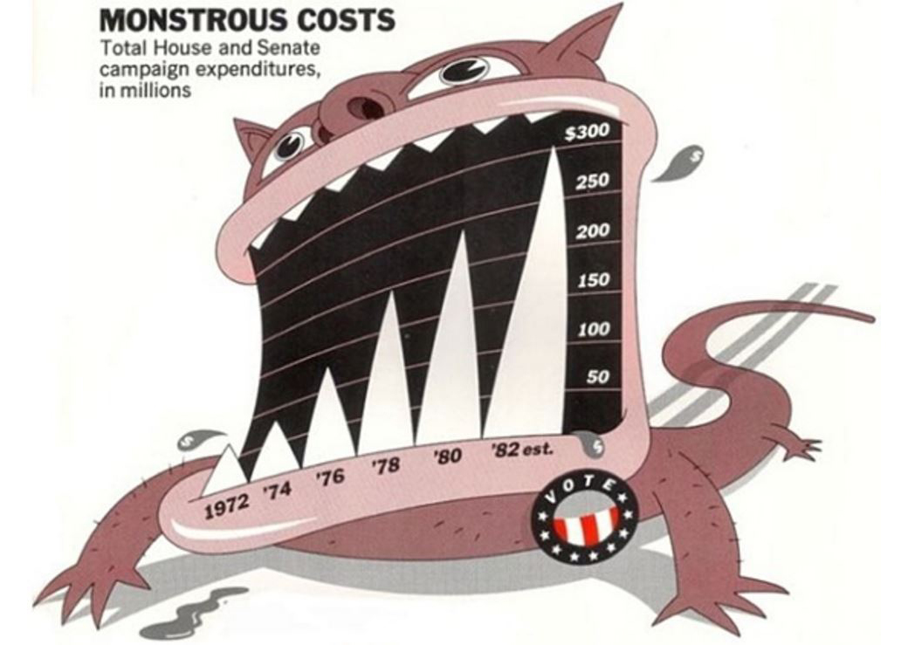]

---

# Visualising data

.center[]

---
class: inverse
background-image: url('./resources/franki-chamaki-694946-unsplash.jpg')
background-size: cover

# 

---

# Bad data

.center[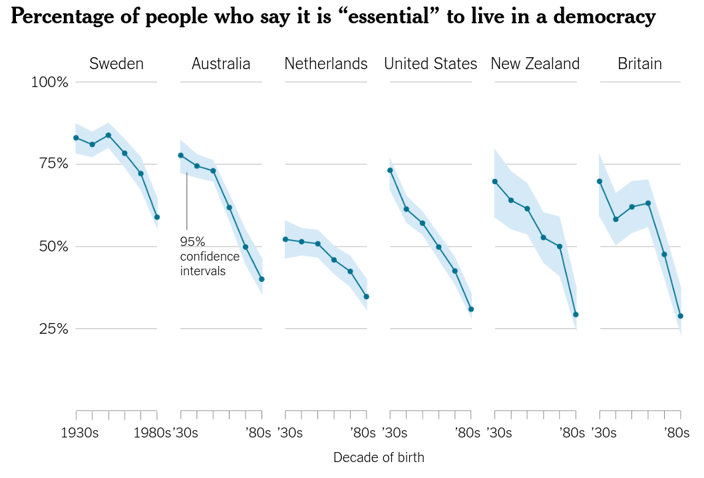]

---

# Bad data

.center[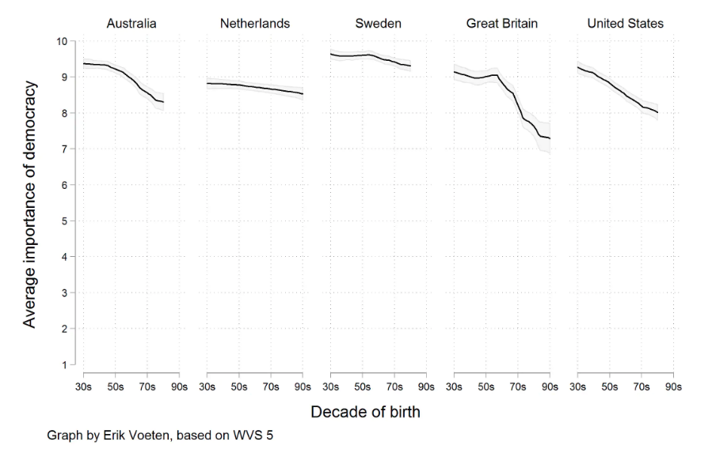]

---

# Bad Data

.center[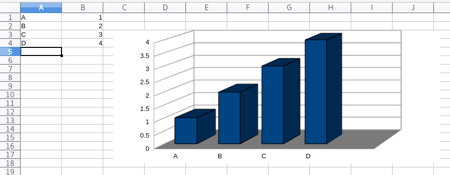]

---

# Perception

.row[

.col-6[

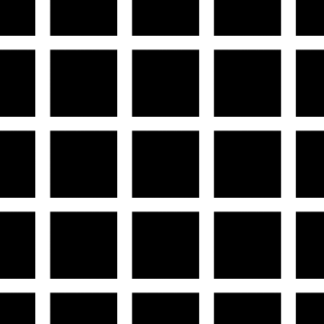

]

.col-6[


]

]

---

# Perception

.row[

.col-8[

.center[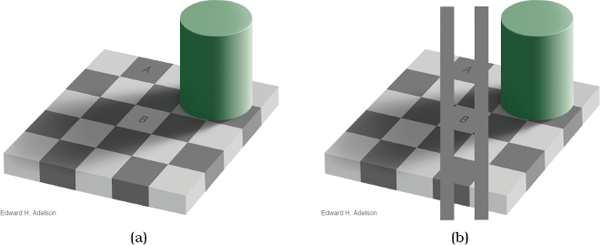]

]

.col-4[

.center[]

]

]

---
class: inverse
background-image: url('./resources/isaac-smith-1182056-unsplash.jpg')
background-size: cover

# Mapping

---

# Mapping

Drawing a graph involves mapping data to visual attributes

Some mappings more effective than others

.center[]

---

# Accuracy of Mappings

.center[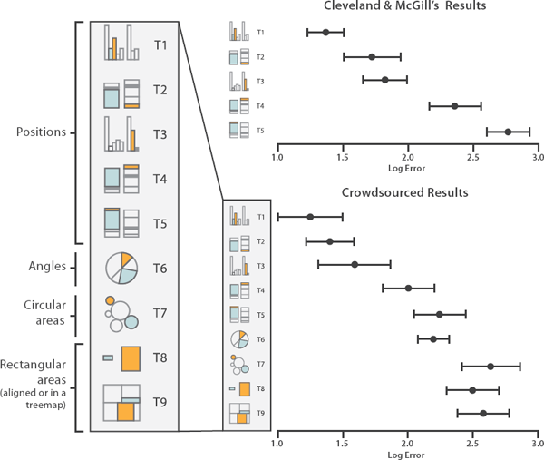]

---
background-image: url('./resources/sharon-pittaway-98257-unsplash.jpg')
background-size: cover

# Colour

---
class: inverse
background-image: url('./resources/michael-maasen-587273-unsplash.jpg')
background-size: cover

# Colour models

---

# Colour models

.row[

.col-6[

* Red Green Blue &mdash; RGB
    
	* Hexadecimal (base 16)
	
	* '0'&ndash;'9' with 'A'&ndash;'F' for 10-15
	
	* Encode 256 values of each colour
	
	* In R `"#AA6633"`
	
	* TVs, Digital cameras, etc

* Cyan Yellow Magenta Black &mdash; CYMK
    
	* Covers a much wider range of colours than RGB
    
	* Magazines, printing

]

.col-6[

* Hue Chroma Luminance &mdash; HCL
    
	* Hue &mdash; colour
	
	* Chroma &mdash; how much of the colour
	
	* Luminance &mdash; brightness
	
	* Designed to reflect human colour perception

]

]

---

# Colour palettes

A colour palette is a the colour scheme or selection used to represent data or design on a graph

Want more than a numerical mapping &mdash; want perceptually uniform mappings

.row[

.col-4[

* discrete

* sequential

* diverging

]

.col-8[

.center[
```{r discrete-pal, fig.height = 1, fig.width = 7, echo = FALSE, dpi = 150}
op <- par(mar = c(0,0,0,0) + 0.1)
swatchplot(qualitative_hcl(7, palette = "set2"))
par(op)
```
```{r sequential-pal, fig.height = 1, fig.width = 7, echo = FALSE, dpi = 150}
op <- par(mar = c(0,0,0,0) + 0.1)
swatchplot(sequential_hcl(7, palette = "Inferno"))
par(op)
```
```{r diverging-pal, fig.height = 1, fig.width = 7, echo = FALSE, dpi = 150}
op <- par(mar = c(0,0,0,0) + 0.1)
swatchplot(diverging_hcl(7, palette = "Blue-Red"))
par(op)
```
]

]
]

---

# Discrete palettes

.row[

.col-6[

* Categorical data

* Easily distinguishable

* Favour no one colour

* Vary H, constant C & L

]

.col-6[

.center[
```{r hcl-discrete-spectrum, fig.height = 8, fig.width = 8, echo = FALSE, dpi = 150}
p <- qualitative_hcl(5, palette = "set2")
specplot(p)
```
]
]
]

---

# Sequential palettes

.row[

.col-6[

* Continuous data

* Brightness & intensity of colour vary

* Vary C & L, constant H

]

.col-6[

.center[
```{r hcl-sequential-spectrum, fig.height = 8, fig.width = 8, echo = FALSE, dpi = 150}
specplot(sequential_hcl(50, palette = "Blues-2"))
```
]

]

]

---

# Sequential multi-hue palettes

.row[

.col-6[

* Continuous data

* Can vary everything if careful

* Vary H, C & L

]

.col-6[

.center[
```{r hcl-sequential-spectrum-2, fig.height = 8, fig.width = 8, echo = FALSE, dpi = 150}
specplot(sequential_hcl(100, palette = "Inferno"))
```
]

]

]

---

# Diverging palettes

.row[

.col-6[

* Continuous data where mid-point means something (0)

* Single hue in each arm

* C & L are balanced in each arm

* C goes to 0 at mid-point


]

.col-6[

.center[
```{r hcl-diverging-spectrum, fig.height = 8, fig.width = 8, echo = FALSE, dpi = 150}
specplot(diverging_hcl(100, palette = "Blue-Red"))
```
]

]

]

---

# Rainbow

.center[
```{r rainbow-swatch, fig.height = 3, fig.width = 8, echo = FALSE, dpi = 150}
swatchplot(rainbow(500))
```
]

---

# #endrainbow

.row[

.col-6[

* Luminance is not linear or even monotonic

* Colour vision deficiency

]

.col-6[

.center[
```{r rainbow-spectrum, fig.height = 8, fig.width = 8, echo = FALSE, dpi = 150}
specplot(rainbow(100), rgb = TRUE)
```
]

]

]

---

# #endrainbow

.center[
```{r rainbow-desat-swatch, fig.height = 3, fig.width = 8, echo = FALSE, dpi = 150}
swatchplot(desaturate(rainbow(500)))
```
]

---

# #endrainbow

.center[
```{r rainbow-deutan-swatch, fig.height = 3, fig.width = 8, echo = FALSE, dpi = 150}
swatchplot(tritan(rainbow(500)))
```
]

---

# Colour vision deficiency

Decreased ability to see colour or differences in colour

.row[

.col-6[

* Red-Green CVD is sex-linked
* Gene carried on X chromosome
* Blue-Yellow CVD is not; chromosome 7
* -anomaly vs -anopia

.center[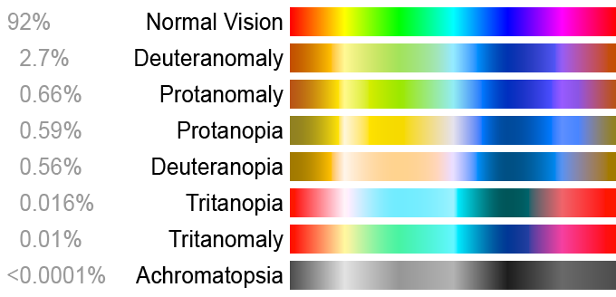]

]

.col-6[

.center[]

]

]

---

# Pop

Can you see the green squares?

.center[]

---

# Preattentive pop-out

Some shapes, colours, angles more easy to spot

Can happen before (or almost before) before consciously looking at something

.row[

.col-6[

.center[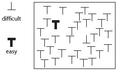]

]

.col-6[

.center[]

]

]

.row[

.col-6[

.center[]

]

.col-6[

.center[]

]

]

---
# Bad graphs

.center[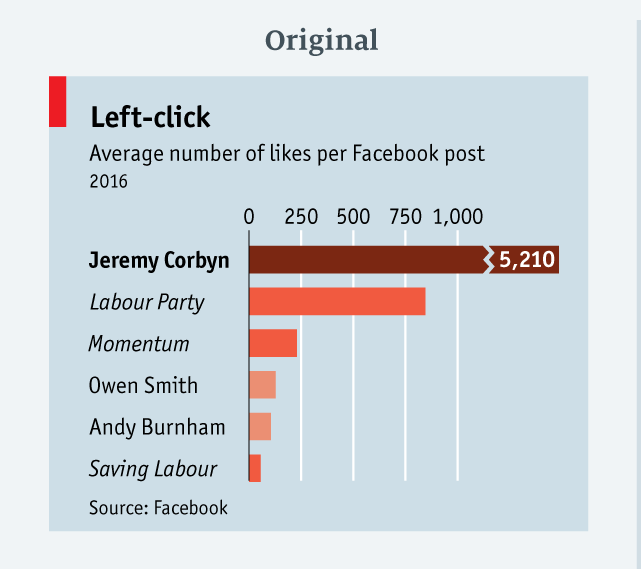]

---

# Bad graphs

.center[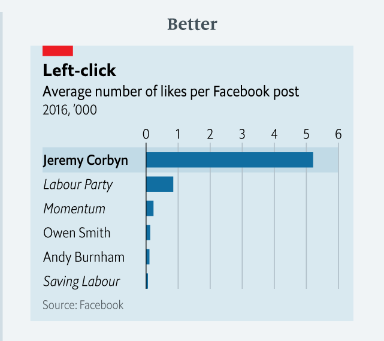]

---

# Bad graphs

.center[]

---

# Bad graphs

.center[]

---

# Bad graphs

.center[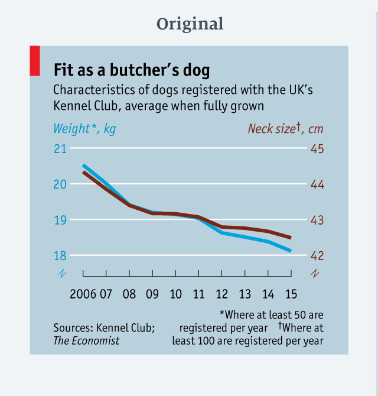]

---

# Bad graphs

.center[]


