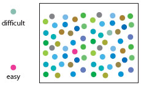

```{r setup, include=FALSE, cache = FALSE}
options(htmltools.dir.version = FALSE)
knitr::opts_chunk$set(cache = TRUE)
library('ggplot2')
library('dplyr')
library('tidyr')
library('colorspace')
library('cowplot')
library('gapminder')
```
class: inverse
background-image: url('./resources/cody-davis-253928-unsplash.jpg')
background-size: cover

# Pop

.footnote[
<a style="background-color:black;color:white;text-decoration:none;padding:4px 6px;font-family:-apple-system, BlinkMacSystemFont, &quot;San Francisco&quot;, &quot;Helvetica Neue&quot;, Helvetica, Ubuntu, Roboto, Noto, &quot;Segoe UI&quot;, Arial, sans-serif;font-size:12px;font-weight:bold;line-height:1.2;display:inline-block;border-radius:3px" href="https://unsplash.com/@codytdavis?utm_medium=referral&amp;utm_campaign=photographer-credit&amp;utm_content=creditBadge" target="_blank" rel="noopener noreferrer" title="Download free do whatever you want high-resolution photos from Cody Davis"><span style="display:inline-block;padding:2px 3px"><svg xmlns="http://www.w3.org/2000/svg" style="height:12px;width:auto;position:relative;vertical-align:middle;top:-2px;fill:white" viewBox="0 0 32 32"><title>unsplash-logo</title><path d="M10 9V0h12v9H10zm12 5h10v18H0V14h10v9h12v-9z"></path></svg></span><span style="display:inline-block;padding:2px 3px">Cody Davis</span></a>
]

---

# Pop

Can you see the green squares?

.center[]

---

# Pop

```{r pop-1, echo = FALSE, dpi = 200, fig.width = 16, fig.height = 8, out.height = 550}
theme_set(theme_minimal())
set.seed(1)
N <- 20
df <- data.frame(x = runif(N), y = runif(N), grp = sample(rep(c('a','b'), times = c(1, N-1))))
p1 <- ggplot(df, aes(x = x, y = y, colour = grp)) +
    geom_point(size = 2.5) +
    scale_colour_manual(values = c('#004488','#ddaa33')) +
    theme(legend.position = 'none') +
    labs(title = 'N = 20', y = NULL, x = NULL) +
    coord_cartesian(xlim = c(0,1), ylim = c(0,1))
set.seed(100)
N <- 100
df <- data.frame(x = runif(N), y = runif(N), grp = sample(rep(c('a','b'), times = c(1, N-1))))
p2 <- ggplot(df, aes(x = x, y = y, colour = grp)) +
    geom_point(size = 2.5) +
    scale_colour_manual(values = c('#004488','#ddaa33')) +
    theme(legend.position = 'none') +
    labs(title = 'N = 100', y = NULL, x = NULL) +
    coord_cartesian(xlim = c(0,1), ylim = c(0,1))
set.seed(200)
N <- 20
df <- data.frame(x = runif(N), y = runif(N), grp = sample(rep(c('a','b'), times = c(1, N-1))))
p3 <- ggplot(df, aes(x = x, y = y, shape = grp)) +
    geom_point(size = 2.5, colour = '#004488') +
    theme(legend.position = 'none') +
    labs(title = 'N = 20', y = NULL, x = NULL) +
    coord_cartesian(xlim = c(0,1), ylim = c(0,1))
set.seed(300)
N <- 100
df <- data.frame(x = runif(N), y = runif(N),
                 grp1 = sample(rep(c('a','b'), times = c(1, N-1))),
                 grp2 = sample(rep(c('1','2'), each = N/2)))
p4 <- ggplot(df, aes(x = x, y = y, colour = grp1, shape = grp2)) +
    geom_point(size = 2.5) +
    scale_colour_manual(values = c('#004488','#ddaa33')) +
    theme(legend.position = 'none') +
    labs(title = 'N = 100', y = NULL, x = NULL) +
    coord_cartesian(xlim = c(0,1), ylim = c(0,1))
plot_grid(p1, p2, p3, p4, nrow = 1)
```

---

# Preattentive pop-out

Some shapes, colours, angles more easy to spot

Can happen before (or almost before) before consciously looking at something

.row[

.col-6[

.center[]

]

.col-6[

.center[]

]

]

.row[

.col-6[

.center[]

]

.col-6[

.center[]

]

]


---
class: inverse
background-image: url('./resources/isaac-smith-1182056-unsplash.jpg')
background-size: cover

# Making a plot

.footnote[
<a style="background-color:black;color:white;text-decoration:none;padding:4px 6px;font-family:-apple-system, BlinkMacSystemFont, &quot;San Francisco&quot;, &quot;Helvetica Neue&quot;, Helvetica, Ubuntu, Roboto, Noto, &quot;Segoe UI&quot;, Arial, sans-serif;font-size:12px;font-weight:bold;line-height:1.2;display:inline-block;border-radius:3px" href="https://unsplash.com/@isaacmsmith?utm_medium=referral&amp;utm_campaign=photographer-credit&amp;utm_content=creditBadge" target="_blank" rel="noopener noreferrer" title="Download free do whatever you want high-resolution photos from Isaac Smith"><span style="display:inline-block;padding:2px 3px"><svg xmlns="http://www.w3.org/2000/svg" style="height:12px;width:auto;position:relative;vertical-align:middle;top:-2px;fill:white" viewBox="0 0 32 32"><title>unsplash-logo</title><path d="M10 9V0h12v9H10zm12 5h10v18H0V14h10v9h12v-9z"></path></svg></span><span style="display:inline-block;padding:2px 3px">Isaac Smith</span></a>
]

---

# The anatomy of a plot

Visualisation involves representing data by lines, shapes, colours, etc.

Map data to visual channels &mdash; some channels more effective than others

*ggplot* provides a set of tools to

* map data to visual elements,
* specify the kind of plot, and
* control the fine details of the final plot

---

# The anatomy of a *ggplot*

A *ggplot* comprises several main elements

1. Data
2. Aesthetic mappings
3. Geoms
4. Co-ordinates & scales
5. Labels & guides

---

# `ggplot()`

Main function is `ggplot()`

- specify `data`, the data frame containing the data
- specify mappings of variables in `data` to *aesthetics* with `aes()`

Add *layers* to plot vis `+`

Geoms are the main layer-types we add to influence the plot

Geoms by default inherit the `data` and *aesthetics* from the `ggplot()` call

```{r ggplot-anatomy, eval = FALSE}
ggplot(data_frame, aes(x = var1, y = var2, colour = var3)) +
    geom_<type>(....) +
    geom_<type>(....)
```

---

# Data

Two main ways in which data tend to be recorded

1. *wide*-format
2. *long*-format

In *long*-format:

* every column is a variable
* every row is an observation

In *wide*-format

* some variables are spread out over multiple columns

*ggplot* requires data in *long* form

---

# Wide-format

```{r wide-format-data, echo = FALSE}
select(gapminder, country, year, lifeExp) %>%
    spread(year, lifeExp)
```

---

# Long-format

```{r long-format-data, echo = FALSE}
select(gapminder, country, year, lifeExp)
```

---

# Long-format

Data arranged in *key* and *value* pairs

`year` is the *key*

`lifeExp` is the *value*

```{r long-format-data-2, echo = FALSE}
head(select(gapminder, country, year, lifeExp), 5)
```

---

# Long-format

Can have multiple *key* and *value* columns

```{r long-format-data-3, echo = FALSE}
head(gapminder, 5)
```

---
class: inverse
background-image: url('./resources/jeffrey-buchbinder-661201-unsplash.jpg')
background-size: cover

# RStudio tour

.footnote[
<a style="background-color:black;color:white;text-decoration:none;padding:4px 6px;font-family:-apple-system, BlinkMacSystemFont, &quot;San Francisco&quot;, &quot;Helvetica Neue&quot;, Helvetica, Ubuntu, Roboto, Noto, &quot;Segoe UI&quot;, Arial, sans-serif;font-size:12px;font-weight:bold;line-height:1.2;display:inline-block;border-radius:3px" href="https://unsplash.com/@jbuchbinder?utm_medium=referral&amp;utm_campaign=photographer-credit&amp;utm_content=creditBadge" target="_blank" rel="noopener noreferrer" title="Download free do whatever you want high-resolution photos from Jeffrey Buchbinder"><span style="display:inline-block;padding:2px 3px"><svg xmlns="http://www.w3.org/2000/svg" style="height:12px;width:auto;position:relative;vertical-align:middle;top:-2px;fill:white" viewBox="0 0 32 32"><title>unsplash-logo</title><path d="M10 9V0h12v9H10zm12 5h10v18H0V14h10v9h12v-9z"></path></svg></span><span style="display:inline-block;padding:2px 3px">Jeffrey Buchbinder</span></a>
]

---

# gapminder data set

```{r load-gapminder}
library('gapminder')                    # load package
gapminder                               # print data frame
```

---

# Our first plot

Say we want to plot life expepctancy (`lifeExp`) against per capita GDP `gdpPercap`

```{r gap-plot-1}
p <- ggplot(data = gapminder)
```

We tell `ggplot()` *where* to look for variables, but haven't specified any mappings yet

Assigned the ouput of the `ggplot()` call to the object `p` (could call `p` anything)

<kbd>Alt + -</kbd>

or 

<kbd>Option + -</kbd>

types the *assignment operator* `<-`

---

# Our first plot

We specify mappings between variables and aesthetics via the `mapping` argument

Use the `aes()` function to specify the mappings

```{r gap-plot-2}
p <- ggplot(data = gapminder,
            mapping = aes(x = gdpPercap, y = lifeExp))
```

This sets up a mapping between our two variables and the `x` and `y` aesthetics

The `x` and `y` aesthetics are the $x$ and $y$ coordinates of the plot

---

# Our first plot

We can draw the plot by `print()`ing the object `p`

What do you think you'll get if you print `p`?

```{r gap-plot-3, eval = FALSE}
p
```

---

# Our first plot

```{r reset-theme-1, echo = FALSE}
theme_set(theme_grey())
```
Only the *scale* for the x and y aesthetics is drawn

```{r gap-plot-4, fig.width = 8, fig.height = 4, dpi = 200, out.height = 400}
p
```

---

# Adding a layer

Need to tell `ggplot()` *how* we want the data drawn

Need to choose a *geometric object* or *geom*

*geoms* are functions with names `geom_<type>()`

A *geom* adds a layer to an existing plot

For a scatterplot, we represent the $x$, $y$ pairs via points `geom_point()`

---

# Adding a layer

```{r gap-plot-5, fig.width = 8, fig.height = 4, dpi = 200, out.height = 400}
p + geom_point()
```

---

# Putting it all together

```{r gap-plot-6, fig.width = 8, fig.height = 4, dpi = 200, out.height = 400}
ggplot(data = gapminder,
       mapping = aes(x = gdpPercap, y = lifeExp)) +
    geom_point()
```

---
class: inverse
background-image: url('./resources/fancycrave-264511-unsplash.jpg')
background-size: cover

# Your turn

.footnote[
<a style="background-color:black;color:white;text-decoration:none;padding:4px 6px;font-family:-apple-system, BlinkMacSystemFont, &quot;San Francisco&quot;, &quot;Helvetica Neue&quot;, Helvetica, Ubuntu, Roboto, Noto, &quot;Segoe UI&quot;, Arial, sans-serif;font-size:12px;font-weight:bold;line-height:1.2;display:inline-block;border-radius:3px" href="https://unsplash.com/@fancycrave?utm_medium=referral&amp;utm_campaign=photographer-credit&amp;utm_content=creditBadge" target="_blank" rel="noopener noreferrer" title="Download free do whatever you want high-resolution photos from Fancycrave"><span style="display:inline-block;padding:2px 3px"><svg xmlns="http://www.w3.org/2000/svg" style="height:12px;width:auto;position:relative;vertical-align:middle;top:-2px;fill:white" viewBox="0 0 32 32"><title>unsplash-logo</title><path d="M10 9V0h12v9H10zm12 5h10v18H0V14h10v9h12v-9z"></path></svg></span><span style="display:inline-block;padding:2px 3px">Fancycrave</span></a>
]


**Create a scatterplot of *population* and *per captia GDP***

---

# Previously on…

* *ggplot* provides a set of tools to
    * map data to visual elements
    * specify the kind of plot
    * control fine details of the plot
* A *ggplot* comprises several elements
    1. Data — via the `data` argument
    2. Aesthetic mappings — via the `aes()` argument
    3. Geometric objects or *geoms*
    4. Coordinates & scales
    5. Labels & Guides
* Preparing data — **tidy** or **long** data not **wide**
* Created our first plot

---

# Previously on…

```{r recap-code, fig.show = 'hide', cache = FALSE}
library('gapminder')
library('ggplot2')

p <- ggplot(data = gapminder,
            mapping = aes(x = gdpPercap, y = lifeExp))

p + geom_point()

ggplot(data = gapminder,
       mapping = aes(x = gdpPercap, y = lifeExp)) +
    geom_point()
```

---

# geoms don't always draw the data

```{r gap-plot-7, fig.width = 8, fig.height = 4, dpi = 200, out.height = 400}
p  <- ggplot(data = gapminder, mapping = aes(x = gdpPercap, y = lifeExp))
p + geom_smooth()
```

---

# `geom_smooth()` adds a smooth via a <small>GAM</small> or <small>LOESS</small>

```{r gap-plot-8, fig.width = 8, fig.height = 4, dpi = 200, out.height = 400, ref.label = 'gap-plot-7'}
```

---

# Plots with multiple layers

```{r gap-plot-9, fig.width = 8, fig.height = 4, dpi = 200, out.height = 400, message = FALSE}
p  <- ggplot(data = gapminder, mapping = aes(x = gdpPercap, y = lifeExp))
p + geom_point() + geom_smooth()
```

---

# Geoms inherit data and mappings

Didn't need to tell each geom what data or mappings to use

Information is *inherited* from the main `ggplot()` object

Can override this

```{r gap-plot-10, eval = FALSE, ref.label = 'gap-plot-9'}
```

---

# `scale_<aes>_<type>()` control scales

Tick labels modified via `labels` &mdash; convenient functions in *scales* package

```{r gap-plot-11, fig.width = 8, fig.height = 4, dpi = 200, out.height = 400, message = FALSE}
p + geom_point() + geom_smooth() + scale_x_log10(labels = scales::dollar)
```

---

# Mapping vs setting aesthetics

```{r gap-plot-12, fig.width = 8, fig.height = 4, dpi = 200, out.height = 400, message = FALSE}
p  <- ggplot(data = gapminder,
             mapping = aes(x = gdpPercap, y = lifeExp, colour = continent))
p + geom_point() + scale_x_log10()
```

---

# Setting aesthetics &mdash; the wrong way

```{r gap-plot-13, fig.width = 8, fig.height = 4, dpi = 200, out.height = 400, message = FALSE}
p  <- ggplot(data = gapminder,
             mapping = aes(x = gdpPercap, y = lifeExp, colour = "purple"))
p + geom_point() + scale_x_log10()
```

---

# Setting aesthetics &mdash; the right way

Mappings are in `aes()`, settings go *outside* `aes()`

```{r gap-plot-14, fig.width = 8, fig.height = 4, dpi = 200, out.height = 400, message = FALSE}
p  <- ggplot(data = gapminder, mapping = aes(x = gdpPercap, y = lifeExp))
p + geom_point(colour = "purple") + scale_x_log10()
```

---

# Setting aesthetics &mdash; the right way

Mappings are in `aes()`, settings go *outside* `aes()`

`alpha` controls transparency, `size` controls how big things are

.row[

.col-6[
```{r gap-plot-15, eval = FALSE}
ggplot(gapminder,
       aes(x = gdpPercap,
           y = lifeExp)) +
    geom_point(alpha = 0.3) +
    geom_smooth(method = 'lm',
                colour = 'orange',
                se = FALSE, size = 2) +
    scale_x_log10()
```
]

.col-6[

```{r gap-plot-16, fig.width = 8, fig.height = 4, dpi = 100, message = FALSE, ref.label = 'gap-plot-15', echo = FALSE}
```

]

]

---

# `labs()` &mdash; setting plot labels

```{r gap-plot-17, eval = FALSE}
ggplot(gapminder, aes(x = gdpPercap, y = lifeExp)) +
    geom_point(alpha = 0.3) +
    geom_smooth(method = 'lm', colour = 'orange', se = FALSE, size = 2) +
    scale_x_log10() +
    labs(x = 'GDP Per Capita',
         y = 'Life Expectancy in Years',
         title = 'Economic growth 7 life expectancy',
         subtitle = 'Data points are country-years',
         caption = 'Source: Gapminder')
```

---

# `labs()` &mdash; setting plot labels

```{r gap-plot-18, fig.width = 8, fig.height = 4, dpi = 200, message = FALSE, ref.label = 'gap-plot-17', echo = FALSE}
```

---

# Reusing elements

You can save time and effort by reusing plot elements

```{r set-labs}
my_labs <- labs(x = 'GDP Per Capita',
                y = 'Life Expectancy in Years',
                title = 'Economic growth 7 life expectancy',
                subtitle = 'Data points are country-years',
                caption = 'Source: Gapminder')
```

.row[

.col-6[

Then resuse

```{r use-labs, eval = FALSE}
p + geom_point() + geom_smooth() +
    scale_x_log10() + my_labs
```
]

.col-6[

```{r use-labs-2, fig.width = 8, fig.height = 4, dpi = 200, message = FALSE, echo = FALSE, ref.label = 'use-labs'}
```

]

]

---

# Matching aesthetics

```{r gap-plot-19, fig.width = 8, fig.height = 4, dpi = 200, out.height = 400}
ggplot(gapminder, aes(x = gdpPercap, y = lifeExp, colour = continent,
                      fill = continent)) +
    geom_point() + geom_smooth(method = 'gam') +
    scale_x_log10() + my_labs
```

---

# Mapping aesthetics per geom

```{r gap-plot-20, fig.width = 8, fig.height = 4, dpi = 200, out.height = 400}
ggplot(gapminder, aes(x = gdpPercap, y = lifeExp)) +
    geom_point(mapping = aes(colour = continent)) + geom_smooth(method = 'gam') +
    scale_x_log10() + my_labs
```

---

# Mapping continuous variables

```{r gap-plot-21, fig.width = 8, fig.height = 4, dpi = 200, out.height = 400}
ggplot(gapminder, aes(x = gdpPercap, y = lifeExp)) +
    geom_point(mapping = aes(colour = log10(pop))) +
    scale_x_log10() + my_labs
```

---

# `ggsave()` &mdash; Saving your work

Plots can be rendered to disk in a range of formats &mdash; <small>PNG</small>, <small>PDF</small>, ...

Type of file depends on the extension given in `filename`

`ggsave()` saves the last `ggplot` object plotted

```{r gap-plot-22, fig.show = 'hide'}
ggplot(gapminder, aes(x = gdpPercap, y = lifeExp)) +
    geom_point(mapping = aes(colour = log10(pop))) +
    scale_x_log10() + my_labs

## save the last plot
ggsave('my-plot.png')
```

---

# `ggsave()` &mdash; Saving your work

Plots can be rendered to disk in a range of formats &mdash; <small>PNG</small>, <small>PDF</small>, ...

Type of file depends on the extension given in `filename`

`ggsave()` saves a specific `ggplot` object if given on

```{r gap-plot-23, fig.show = 'hide'}
my_plt <- ggplot(gapminder, aes(x = gdpPercap, y = lifeExp)) +
    geom_point(mapping = aes(colour = log10(pop))) +
    scale_x_log10() + my_labs

## save a specific plot object
ggsave('my-plot.pdf', plot = my_plt)
```

---

# `ggsave()` &mdash; Specifying size

`ggsave()` always saves objects in inches & takes the size from the device if not specified

Can set `width` and `height` to numeric values and select the units via `units`

```{r gap-plot-24, fig.show = 'hide'}
my_plt <- ggplot(gapminder, aes(x = gdpPercap, y = lifeExp)) +
    geom_point(mapping = aes(colour = log10(pop))) +
    scale_x_log10() + my_labs

## save a specific plot object
ggsave('my-plot-cm.pdf', plot = my_plt, height = 10, width= 20, units = 'cm')
```
